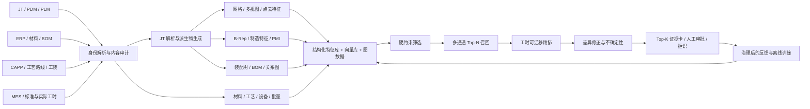

# JT 数模相似件检索与工时类比估算调研

> 版本：v1.0  
> 日期：2026-07-22  
> 对象：4 个 JT 10.0 装配数模及后续历史零件库  
> 目标：当工时分析遇到新零件时，从历史库检索“工艺与工时可迁移”的相似件，并给出可解释的工时参考  
> 文档性质：技术调研与 PoC 立项建议，不是生产阈值或最终算法规格

## 1. 结论先行

本课题不应被定义为“找外形最像的零件”，而应定义为：

> 在材料、毛坯、批量、制造地点、设备能力和质量要求等约束下，寻找工艺路线与工时最可迁移的历史零件，并量化新旧零件之间的差异和估算不确定性。

主要结论如下：

1. **几何相似不等于工时相似。** 外形接近的零件可能因材料、毛坯、公差、粗糙度、装夹、设备或批量不同而产生完全不同的工时；外形不完全相同的零件，也可能共享高度可复用的工艺路线。
2. **当前 4 个 JT 样例具备开展高质量 PoC 的几何基础。** 只读结构审计确认，四个文件都含装配场景树、三档网格 LOD、PMI/元数据、Parasolid XT B-Rep 精确几何和线框，不是只能做截图或低精度网格相似度的文件。
3. **叶子零件与装配体必须分开建模和检索。** 叶子零件重点比较制造特征、PMI、毛坯、装夹与路线；装配体重点比较 BOM、连接关系、可达性、测试和装配顺序。两者不能进入同一个无差别向量库。
4. **推荐“硬约束 + 多通道召回 + 工时可迁移精排 + 人工复核/拒识”的混合路线。** 几何向量只作为一个召回通道，制造特征、PMI、工艺路线和历史工时才是精排与工时修正的核心。
5. **PoC 应先做可解释基线，再做深度模型。** 四个文件足够验证 JT 解析、特征抽取和界面，不足以训练或统计验证深度检索模型。首版应使用确定性几何描述符、专家权重、规则和 Top-K 证据卡；积累标注后再引入 B-Rep GNN、度量学习或 Learning-to-Rank。
6. **系统必须允许输出“没有可靠相似件”。** 生产系统不能为了给答案而强行返回一个候选；置信度、数据缺失、超出历史分布和候选分歧都应进入拒识判断。
7. **相似件工时不能直接复制。** 应拆分准备、单件、检验和其他工时，结合材料去除量、制造特征、装夹、公差、设备和批量差异进行修正，并输出区间而不是单点“伪精确值”。

建议的系统输出不是一个“相似度百分比”，而是一组可审核结果：

- Top-3 或 Top-5 历史相似件；
- 材料、尺寸、全局几何、B-Rep 拓扑、制造特征、PMI、工艺和装夹的分项得分；
- 相同点、差异点以及未匹配特征；
- 候选历史工时的数据口径、批量、工厂、设备和可信度；
- 修正后的参考工时、预测区间和差异贡献；
- 自动建议、强制人工复核或“无可靠相似件”的结论。

这一方向与早期制造相似检索研究的目标一致：NIST 将问题定义为从实体模型及相关制造计划中寻找可复用的历史制造方案，而非只比较视觉外形。[NIST：Feature-Based Similarity Assessment of Solid Models](https://www.nist.gov/publications/feature-based-similarity-assessment-solid-models)

## 2. 问题定义与业务边界

### 2.1 目标对象

查询对象记为新零件或新装配体 \(q\)，历史库对象记为 \(c\)。系统需要学习或计算的不是单一形状相似度，而是：

\[
P\left(\text{使用 }c\text{ 作为 }q\text{ 的类比案例后，工时误差不超过业务容差 }\delta\right)
\]

因此检索目标包含三层含义：

1. **几何相似：** 外形、尺寸、拓扑和局部结构是否相近；
2. **制造相似：** 材料、毛坯、制造特征、PMI、装夹、设备和路线是否可比；
3. **工时可迁移：** 历史工时在差异修正后，是否能稳定估计新件工时。

三者中，第三层才是业务目标，前两层是证据和手段。

### 2.2 必须拆开的两类任务

#### 叶子零件制造工时

适用于机加工、铸造后加工、磨削、热处理、冲压、注塑等单件制造。核心比较对象为：

- 材料、毛坯形态和余量；
- 孔、槽、腔、台阶、凸台、筋、薄壁、圆角和自由曲面；
- 特征尺寸、相交关系、加工方向和可达性；
- 尺寸公差、GD&T、粗糙度、基准和关键质量特性；
- 工艺路线、设备组、刀具、装夹、检验与批量。

#### 装配与测试工时

适用于当前文件名中大量出现的 `ASM` 对象。核心比较对象为：

- BOM 总数量、唯一件数量、重复实例数量和层级深度；
- 紧固、压装、焊接、粘接、密封、卡接等连接方式；
- 装配关系图、接触/配合关系、工具可达性和翻转次数；
- 专用工装、调整、加注、测试、校准和终检要求；
- 装配顺序以及工位间物流。

建议建立独立的“叶子零件索引”和“装配索引”。装配总工时还应按以下口径拆分，避免把制造和装配混成一个标签：

\[
H_{\text{total}}=H_{\text{part manufacturing}}+H_{\text{assembly}}+H_{\text{test}}+H_{\text{logistics}}
\]

### 2.3 典型误区

| 误区 | 为什么会失败 | 正确做法 |
|---|---|---|
| 用单个 3D embedding 决定最终相似件 | embedding 往往更关注类别和外形，不能保证工艺与工时可迁移 | 几何向量做召回，制造特征、PMI、路线和工时做精排 |
| 所有模型都做尺度归一化 | 会抹掉设备包络、走刀长度、搬运和材料去除量的影响 | 同时保存尺度归一化向量与真实尺寸特征 |
| 把低精度 LOD 当精确 CAD | 小孔、薄壁、圆角和公差可能消失或失真 | 有 XT B-Rep 时优先走精确几何路径；网格仅作降级路径 |
| 把文件名当主键 | 文件名可能与 JT 内部根对象或 PLM 标识不一致 | 使用零件号、版本、内部 UID、工厂与有效期建立主键 |
| 直接复制最相似件总工时 | 忽略批量、准备、检验、设备和新增特征差异 | 拆分工时并做差异修正与区间估计 |
| 永远返回一个候选 | 库中可能根本没有可迁移案例 | 建立 OOD、冲突和拒识机制 |

## 3. 四个 JT 样例的只读审计

### 3.1 审计依据与方法

审计过程没有修改原始文件。主要步骤为：

1. 读取 80 字节 JT 版本字段、字节序、TOC 偏移和 LSG 标识；
2. 按 TOC 条目解析段 GUID、偏移、长度和 Segment Type；
3. 检查所有段边界与重叠；
4. 使用 Python 标准库 `lzma` 在内存中解压支持压缩的段；
5. 按对象 GUID 统计 LSG 场景树节点；
6. 读取长度前缀 UTF-16 属性、内部 CAD 引用和工具链信息。

Siemens JT 10.6 规范说明：JT 文件头包含版本、字节序、TOC 偏移和 LSG Segment ID；TOC 将 Segment ID 映射到文件偏移；Segment Type 1、3、4、7-16、17、18 分别覆盖 LSG、PMI、元数据、各级 Shape LOD、XT B-Rep 和 Wireframe。[Siemens：JT File Format Reference V10.6](https://www.siemens.com/en-gb/products/plm-components/jt/jt-open-program/)

ISO 14306 对 JT 支持的内容包括压缩三角面片、PMI、B-Rep、配置和元数据。旧的单卷 [ISO 14306:2017](https://www.iso.org/standard/62770.html) 已在 2026 年被新的多部分系列替代，但仍可用于理解 JT 10 时代的内容能力。

### 3.2 文件结构结果

四个样例均为 little-endian，文件头均为：

```text
Version 10.0 JT  DM 9.5.2.0
```

TOC 偏移均为 109，所有 TOC 条目均在文件范围内，且未发现段重叠。

| 样例 | 大小 | TOC 条目 | LSG 场景树元素 | Part 节点 | PMI 段 | Meta 段 | LOD0/1/2 段 | XT B-Rep 段 | Wireframe 段 | 可识别 CAD 引用* |
|---|---:|---:|---:|---:|---:|---:|---:|---:|---:|---:|
| `24292078-007-HOUSING...jt` | 19.67 MiB | 395 | 911 | 73 | 15 | 86 | 73 / 73 / 73 | 71 | 2 | 97 |
| `24047096-001-CASE...jt` | 19.70 MiB | 725 | 1,642 | 126 | 78 | 195 | 108 / 108 / 108 | 117 | 9 | 232 |
| `24047125-001-SUPPORT...jt` | 1.21 MiB | 109 | 234 | 17 | 7 | 26 | 19 / 19 / 19 | 15 | 2 | 48 |
| `24292082-005_Park_ASM.jt` | 12.65 MiB | 514 | 1,163 | 87 | 44 | 123 | 86 / 86 / 86 | 79 | 8 | 152 |

\* “可识别 CAD 引用”是从长度前缀字符串中去重得到的 `.part`、`.asm`、`.jt` 引用数量，可作为复杂度线索，但不等于装配完全展开后的唯一实体数。

段数量也不能简单等同于零件数量。例如一个 Part 可能有多种表示，实例也可能复用同一几何。正式特征抽取必须遍历 LSG，解析产品/实例关系并去重。

### 3.3 已确认可利用的数据

四个样例均确认包含：

- 装配 LSG 和实例变换；
- 三档网格 LOD，可用于快速预览、多视图和点云召回；
- XT B-Rep 精确几何，可用于面、边、环、曲面类型、拓扑和制造特征；
- PMI 数据段与 PMI 相关属性；
- 自定义元数据、零件属性和 PLM 标识；
- 线框数据和模型视图。

已识别的字段类型包括：

- `PartName`、`DB_PART_NO`、`DB_PART_REV`、`DATASET_NAME`；
- `CAD_MATERIAL`、`NX_ObjectMaterial`、`CAD_MASS`、`P_MASS`、`P_VOLUME`；
- `JT_PROP_MEASUREMENT_UNITS=millimeters`、`CAD_MASS_UNITS=kilograms`；
- `JT_PMI_CONTENT_HINT`、默认 Model View、装配结构和 `__PLM_*` 标识；
- CAD Source、Translator Version 和 LOD 配置。

内嵌工具链信息在四个文件中一致：

- JT Open Toolkit 10.5.3.0；
- DirectModel 9.5.2.0；
- XT Toolkit 33.0.89；
- Parasolid 33.0.247；
- Bodyshop 33.0.119。

这意味着样例不是仅含三角面的“轻量壳”，而是可支持精确 B-Rep 与工程属性的复合 JT 文件。

### 3.4 需要特别治理的问题

审计发现文件名和 JT 内部根名称并不总是一致：

- 下载文件 `24292078-007-HOUSING...jt` 的内部根 Partition 名为 `24047550-001-HOUSING ASM-DRV MOT (View).jt`；
- `24292082-005_Park_ASM.jt` 的内部根名为 `24292082-005-ASM_Park.jt`。

因此不能只用下载文件名建库。建议身份键为：

```text
企业零件号 + 版本/Revision + 内部 PLM UID + 对象粒度 + 工厂 + 工艺有效期
```

同时保存文件 SHA-256、内部根名、导出时间、解析器版本和特征模式版本，形成可追溯谱系。

### 3.5 当前仍未完成的几何级解析

只读探针已经证明文件结构完整，但它不是完整 JT 几何内核，尚未完成：

- JT 专用三角带和顶点压缩编码的完整解码；
- 精确顶点/三角形数量和可视化渲染；
- Parasolid XT 的面、边、体、曲率和质量属性解析；
- PMI 实体分类、语义尺寸/公差与图形标注的逐项核验；
- 外部引用加载、隐藏件、实例复用和装配完全展开；
- 几何封闭性、自交、退化和拓扑修复检查。

PoC 第一项交付物应是标准化的“JT 内容审计清单”，而不是立即训练模型。

## 4. JT 读取与转换方案

### 4.1 候选工具比较

| 路线 | 能力 | 优点 | 主要限制 | 建议定位 |
|---|---|---|---|---|
| Siemens JT Open Toolkit | 原生读写产品结构、属性、LOD、PMI 和 XT B-Rep | 保真度最高，JT 语义最完整 | C++ 接入和商业授权需评估 | 生产首选候选 |
| HOOPS Exchange | 官方文档列明支持至 JT v10.10，支持装配、网格、B-Rep 和 PMI | 多格式统一 SDK，工程接入成熟 | 商业授权；JT 10 ULP 有特定限制 | 生产首选候选 |
| Open Cascade JT Import-Export SDK | JT 与 OCCT/XCAF 体系集成 | 便于后续 STEP/B-Rep 算法 | JT 属于商业 Advanced Data Exchange 组件 | 若团队已有 OCCT 技术栈可选 |
| NX/Teamcenter 批量导出 | 从源系统导出 Parasolid/STEP AP242、PLM XML 和网格 | 可复用现有 CAD/PLM 环境，结果易验证 | 需要维护多种导出物，转换可能损失部分属性 | PoC 最快可落地路径 |
| CAD Exchanger SDK/Batch | JT 向 STEP、Parasolid、glTF 等转换 | 多平台和批处理相对易接入 | 商业许可与保真度需用样例验收 | 备选转换路线 |
| 只用 STL/OBJ/GLB | 获取网格做视图/点云检索 | 开发快，生态成熟 | 丢失精确 B-Rep、PMI 和大部分工程语义 | 仅作降级通道 |

[Siemens JT Open Program](https://www.siemens.com/en-gb/products/plm-components/jt/jt-open-program/)说明 JTTK 可访问产品结构、元数据、属性、LOD、PMI 和精确 XT B-Rep。  
[HOOPS Exchange JT Reader](https://docs.techsoft3d.com/hoops/exchange/start/format/jt_reader.html)列出了其 JT 版本、B-Rep、PMI、装配能力与限制。  
[Open Cascade Data Exchange](https://dev.opencascade.org/about/data_exchange)将 JT 列为 Advanced Data Exchange 商业组件。  
[Siemens JT2Go](https://www.siemens.com/en-us/products/plm-components/jt/jt2go/)可用于人工验收产品结构、属性、PMI、模型视图和截面，但查看器不能替代批量特征抽取 SDK。

### 4.2 推荐的数据落地形态

保留 JT 为权威源文件，同时生成以下派生物：

| 派生物 | 用途 | 必须保留的信息 |
|---|---|---|
| Parasolid `.x_t/.x_b` 或 STEP AP242 | 精确 B-Rep、拓扑与制造特征 | 单位、装配层级、名称、颜色、PMI 映射和版本 |
| GLB/glTF 或标准化 mesh | Web 预览、多视图、点云和快速召回 | 实例变换、层级、部件 ID 和固定 LOD |
| JSON/Parquet 特征清单 | 检索、排序、解释和数据审计 | 身份键、来源、质量标志、提取器版本 |
| PLM XML/JSON 装配树 | 装配关系、BOM 和实例复用 | 产品/实例区分、外部引用和内部 UID |

不建议把 STL 作为唯一中间格式，因为它不保留精确曲面、装配语义、PMI、材料和零件属性。

## 5. 面向工时的特征体系

### 5.1 通用特征

| 特征块 | 建议字段 | 与工时的关系 |
|---|---|---|
| 身份与上下文 | 零件/装配、产品族、版本、工厂、制造/外购、有效期 | 决定候选边界与数据谱系 |
| 材料与毛坯 | 材料牌号/材料族、硬度、热处理、铸/锻/棒料/板料/焊接件、毛坯尺寸 | 影响切削参数、余量、设备和附加工序 |
| 真实尺寸 | 包围盒、体积、表面积、质量、质心、惯量、长宽高比 | 影响设备包络、搬运、走刀和材料去除量 |
| 全局形状 | 紧致度、主轴、对称性、凸包比、D2 分布、投影视图 | 快速召回整体形状接近的候选 |
| B-Rep 拓扑 | 实体/壳/面/边/环数量，面邻接图，凹凸边，拓扑复杂度 | 反映局部结构、加工区域和模型复杂度 |
| 曲面/曲线 | 平面、圆柱、圆锥、球、环面、旋转面、NURBS 的数量和面积比例 | 区分车削、铣削、孔系和自由曲面加工 |
| 制造特征 | 通孔、盲孔、沉孔、槽、腔、台阶、凸台、筋、薄壁、倒角、圆角、螺纹 | 与工序、刀具、走刀和去毛刺直接相关 |
| 特征难度 | 深径比、最小壁厚、最小刀具半径、封闭腔、欠切、加工方向、相交关系 | 影响刀具伸出、装夹、风险和节拍 |
| PMI | 尺寸、公差、GD&T、基准、粗糙度、关键特性、焊接和检验要求 | 解释精加工、测量、返修风险和质量工时 |
| 工艺路线 | 工序序列、设备组、刀具、热处理、去毛刺、清洗、检验 | 工时可迁移的直接依据 |
| 装夹 | 定位面、加工方向数、装夹次数、翻转和专用夹具 | 影响准备工时和人工干预 |
| 批量与资源 | 批量档、换型、班组、工厂、设备能力和自动化程度 | 决定准备分摊与单位工时 |
| 历史工时 | 准备、单件、人工、机器、检验、返工、停机和异常原因 | 用于估计、修正和数据清洗 |

### 5.2 两套几何表示必须并存

对每个对象保存两套表示：

1. **尺度/姿态归一化表示：** 用于比较形状和结构；
2. **保留真实单位的表示：** 用于设备能力、材料去除量、走刀、搬运和工时。

姿态归一化可使用主惯性轴或多视图旋转鲁棒策略，但对对称件应保留多个等价姿态。镜像件是否视为同类应按业务配置：某些机加工过程近似等价，装配方向和工装却可能完全不同。

### 5.3 叶子零件制造特征表示

建议将 B-Rep 转为几何属性邻接图：

- 节点：面；属性为曲面类型、面积、法向、曲率、半径、边界环数和 PMI；
- 边：相邻面公共边；属性为曲线类型、长度、二面角、凹凸性和连续性；
- 子图：识别出的孔、槽、腔、台阶、凸台等制造特征；
- 图级属性：体积、面积、惯量、尺寸和材料。

制造特征相似不宜只比较计数。应进行二分图匹配或图匹配，按特征类型、尺寸、深度、方向、公差和拓扑关系一一配对，并对未匹配特征施加惩罚。

### 5.4 装配体表示

装配体建议建成多层图：

- 产品/实例层：零件、子装配、重复实例、变换；
- 连接层：紧固、压装、焊接、粘接、密封和接触；
- 工艺层：装配动作、工位、工装、测试和检验；
- 几何层：包络、遮挡、可达性、翻转和工具路径空间。

装配几何整体相似度只能作为辅助。BOM 组成、连接关系和操作序列通常更能解释装配工时。

## 6. 算法与文献调研

### 6.1 技术路线比较

| 路线 | 典型方法 | 优点 | 局限 | 本项目定位 |
|---|---|---|---|---|
| 手工全局描述符 | D2 Shape Distribution、体积矩、球谐 | 无需训练、速度快、适合小样本 | 对孔槽和工艺语义不敏感 | 首版快速召回与可复现基线 |
| 多视图 | Light Field Descriptor、MVCNN | 对网格格式容忍，可复用 2D 模型 | 受视角影响，内部拓扑和小特征易丢失 | 网格通道和界面视觉证据 |
| 点云 | PointNet、DGCNN 等 | 表示统一、计算相对轻、易做度量学习 | 丢失精确边、曲面类型和 B-Rep 拓扑 | 无 B-Rep 时的主要学习式通道 |
| Mesh 网络 | MeshCNN 等 | 可利用三角网格连通关系 | 对三角划分与 LOD 敏感 | 网格局部精排的备选 |
| B-Rep GNN | UV-Net、BRepNet、FuS-GCN | 保留曲面几何和面边拓扑，契合机械 CAD | 依赖高质量 B-Rep 和解析器 | 本项目中长期主通道 |
| 制造特征网络 | FeatureNet、Hierarchical CADNet、AAGNet | 可直接生成孔槽腔等工时驱动特征 | 公开数据多为合成件，存在域差异 | 特征清单、解释和精排 |
| 度量/对比学习 | Siamese、Triplet、Proxy、GC-CAD、CADGCL | 可学习企业自己的“工时相似”定义 | 需要正负样本、弱标签或可靠增强 | 数据积累后的重点升级 |
| 多模态 | MultiCAD、ULIP、OpenShape | 可融合几何、文本、构造序列和属性 | 通用模型不理解企业工艺，需领域适配 | 融合 JT、PMI、材料与路线的增强通道 |
| 案例推理/残差模型 | CBR、kNN、树模型、Learning-to-Rank | 可解释，适合工时迁移和差异修正 | 强依赖历史工时质量 | 业务结果层的核心方法 |

### 6.2 经典形状检索的启示

- D2 Shape Distribution 将随机表面点对距离编码为分布，计算快、对旋转和三角划分相对稳健，适合作为粗召回基线，但不适合区分局部孔槽。[Osada et al., 2002](https://doi.org/10.1145/571647.571648)
- Light Field Descriptor 和多视图 CNN 说明多角度投影可以形成强全局描述符，但机械件对小细节、姿态和内部结构敏感，单独使用风险较大。[Chen et al., 2003](https://doi.org/10.1111/1467-8659.00669)、[Su et al., 2015](https://doi.org/10.1109/ICCV.2015.114)
- 点云网络能直接学习无序点集或动态图邻域，便于统一不同 CAD 格式，但会损失工程 B-Rep 语义。[PointNet](https://doi.org/10.1109/CVPR.2017.16)、[DGCNN](https://doi.org/10.1145/3326362)

### 6.3 B-Rep 与制造特征的启示

- UV-Net 将曲面/曲线 UV 采样与面邻接图结合，可同时利用连续几何和离散拓扑，并展示了自监督检索能力。[UV-Net](https://doi.org/10.1109/CVPR46437.2021.01153)
- BRepNet 直接在 B-Rep 的 face、edge、coedge 拓扑上传播信息，并发布了 Fusion 360 Gallery 分割数据。[BRepNet](https://doi.org/10.1109/CVPR46437.2021.01258)
- Hierarchical CADNet 和 AAGNet 面向加工特征识别；AAGNet 的 gAAG 同时编码 UV 几何、面邻接和扩展属性，并支持加工特征语义、实例和底面分割。[Hierarchical CADNet](https://doi.org/10.1016/j.cad.2022.103226)、[AAGNet](https://doi.org/10.1016/j.rcim.2023.102661)
- FuS-GCN 与后续自监督 B-Rep 检索工作说明，B-Rep 图不仅可用于分割，也可生成零件级分类/检索向量。[FuS-GCN](https://doi.org/10.1016/j.aei.2023.102008)、[CADGCL](https://doi.org/10.1007/s00371-025-03949-y)

对本项目的直接结论是：**既然四个样例已经确认含 XT B-Rep，就不应把长期方案限制在网格或截图。** 网格通道适合快速召回和预览，B-Rep/制造特征通道更适合工时相关精排。

### 6.4 工艺计划与工时案例推理

机械 CAD 相似检索早已被用于成本估计、CAPP 和制造计划复用。经典工作以几何、拓扑和特征层次组织机械零件，并按工艺相关相似度进行索引和匹配：[El-Mehalawi & Miller Part I](https://doi.org/10.1016/S0010-4485(01)00177-4)、[Part II](https://doi.org/10.1016/S0010-4485(01)00178-6)。

基于案例的工艺规划研究也强调使用零件特征、切削过程层次和相似度检索历史计划，而不是仅按名称或外形复用。[Indexing and Retrieval in Machining Process Planning Using CBR](https://doi.org/10.1016/S0954-1810(99)00027-8)

2024 年的制造时间估算研究显示，将案例推理与机器学习结合，能够同时利用历史案例和非线性修正能力。[Coupling CBR and ML for Manufacturing Time Estimation](https://doi.org/10.1016/j.ifacol.2024.09.156)

### 6.5 可用于预训练或基准的数据集

| 数据集 | 规模与内容 | 可用于本项目 | 不足 |
|---|---|---|---|
| ESB | 867 个工程零件，约 44/45 类 | 传统工程形状检索基线 | 小，无 B-Rep、工艺和工时 |
| MCB | 58,696 个机械部件，68 类 | 机械件分类/检索预训练和指标基准 | 类别相似不等于工时相似 |
| ABC | 约 100 万 CAD 模型及参数曲线/曲面 | B-Rep 和几何自监督预训练 | 无企业工艺与工时 |
| MFCAD++ | 59,665 个 STEP B-Rep，逐面加工特征标签 | 加工特征分割预训练 | 以合成零件为主，存在域差异 |
| MFInstSeg | 6 万余 STEP，24 类加工特征及实例/底面标签 | 加工特征实例分割 | 以合成数据为主 |
| Fusion 360 Gallery | 构造序列、面分割和装配图等多个子集 | B-Rep、构造语义与装配预训练 | 无真实企业工时 |
| ShapeNet/ModelNet | 通用 3D 类别数据 | 验证多视图/点云基础代码 | 制造相关性弱 |

公开数据只能帮助预训练和验证表示方法，不能代替企业自己的“工时可迁移”标签。关键入口包括 [ABC](https://deep-geometry.github.io/abc-dataset/)、[Fusion 360 Gallery](https://github.com/AutodeskAILab/Fusion360GalleryDataset)、[MFCAD++](https://doi.org/10.17034/d1fec5a0-8c10-4630-b02e-b92dc81df823) 和 [MCB](https://doi.org/10.1007/978-3-030-58523-5_11)。

## 7. 推荐系统架构



### 7.1 离线建库

对历史对象批量执行：

1. 身份解析、版本去重和权限继承；
2. JT 内容审计、外部引用检查和格式派生；
3. 零件/装配分流；
4. 全局几何、网格、B-Rep、制造特征、PMI 和装配图抽取；
5. PLM、ERP、CAPP 和 MES 数据关联；
6. 工时异常清洗与口径统一；
7. 结构化特征、向量、图和原文件引用落库；
8. 保存特征版本、解析器版本和完整质量标志。

### 7.2 在线查询

对新模型只处理增量：

1. 检查数据质量、对象粒度和设备能力；
2. 通过材料、制造族、工厂等硬约束过滤；
3. 多通道召回候选并取并集；
4. 以制造特征、PMI、路线、装夹和历史工时质量精排；
5. 生成差异解释、工时修正、区间和拒识结果；
6. 人工确认后才进入正式估算或反馈闭环。

## 8. 分层召回与排序设计

### 8.1 第零层：数据质量门

出现以下情况时，系统应降低置信度或停止自动推荐：

- 装配体与叶子零件粒度不一致；
- 外部引用缺失或实例树未完整展开；
- 单位无法确认；
- 只有低精度网格而关键小特征无法辨认；
- 材料、批量、工厂或关键 PMI 缺失；
- 超出现有设备尺寸、质量、行程或能力；
- 几何损坏、非封闭或解析失败；
- 新件特征明显超出现有库分布。

### 8.2 第一层：硬约束筛选

建议按制造族配置硬约束，而不是全公司只有一套规则。候选字段包括：

- 零件/装配类型；
- 主制造族：回转件、棱柱铣削件、铸造后加工件、板金件、焊接件、注塑件等；
- 自制/外购；
- 工厂和设备能力；
- 不能跨越的材料、热处理或关键质量等级；
- 批量档和工艺有效期。

若新零件尚无路线，可以先预测两个最可能的主制造族，分别召回，再由专家或后续精排判断；不要在信息不足时过早锁死一个工艺族。

### 8.3 第二层：多通道召回

建议并行建立以下通道，并取 Top-N 并集：

- 元数据倒排：产品族、材料族、工艺代码、零件名称；
- 数值 ANN：尺寸、体积、面积、惯量、特征数量和 PMI 统计；
- 全局形状：D2、球谐、凸包/紧致度等；
- 多视图或点云 embedding；
- B-Rep 图 embedding；
- 制造特征集合/图；
- 工艺路线序列；
- 装配 BOM 和关系图。

库规模只有几十或几百件时可直接精确比较；数万件后再引入 HNSW 等近似最近邻索引。[HNSW 论文](https://doi.org/10.1109/TPAMI.2018.2889473)

### 8.4 第三层：工时可迁移精排

初版可使用可解释加权分数：

\[
S(q,c)=Q(q,c)\cdot
\frac{\sum_{b\in A(q,c)} w_b s_b(q,c)}{\sum_{b\in A(q,c)} w_b}
-P_{\text{conflict}}(q,c)
\]

其中：

- \(s_b\)：材料、真实尺寸、全局形状、B-Rep、制造特征、PMI、路线、装夹和装配关系等分项相似度；
- \(A(q,c)\)：查询与候选双方都具备可靠数据的特征块；
- \(Q(q,c)\)：解析完整度、版本可信度、工时数据质量和字段覆盖率；
- \(P_{\text{conflict}}\)：材料、设备、关键公差、对象粒度等冲突惩罚。

重要原则：**缺失字段不是“相同”，也不能简单从分母删除后仍保持高置信度。** 缺失项需要同时降低 \(Q\) 并扩大工时区间。

不同制造族应有不同权重。例如：

- 壳体类铸造后加工件：提高毛坯、壁厚、型腔、加工面、孔系、基准和密封检验权重；
- 回转件：提高直径阶梯、长径比、同轴度、圆柱面比例和车/磨路线权重；
- 板金件：提高板厚、展开、折弯序列、孔边距、成形和回弹相关特征权重；
- 装配体：提高 BOM、连接类型、可达性、翻转、测试和专用工装权重。

有足够标注后，可将精排升级为 pairwise Learning-to-Rank 或度量学习，使模型学习“专家认为适合作为工时参考”的排序，而不是普通类别相似度。

### 8.5 制造特征匹配

设查询件特征集合为 \(F_q\)，候选件为 \(F_c\)。对同类型特征计算局部代价：

\[
d(f_i,f_j)=
\alpha d_{\text{size}}+
\beta d_{\text{depth}}+
\gamma d_{\text{orientation}}+
\eta d_{\text{tolerance}}+
\zeta d_{\text{context}}
\]

再通过匈牙利算法或最小费用匹配得到一一对应关系，对新增、缺失和无法加工的特征施加额外惩罚。这样可在证据卡中直接解释：

```text
共同：8 个通孔、2 个盲孔、1 个主腔体，主要加工方向一致
差异：新件新增 2 个深孔；主腔深度增加 18%；关键粗糙度更严；多 1 次翻转
```

这比只展示“几何相似度 86%”更能支持工时专家判断。

## 9. 从相似件到工时估算

### 9.1 工时必须拆分

建议统一为：

\[
H(q,n)=H_{\text{setup}}+nH_{\text{piece}}+H_{\text{inspection}}(n)+H_{\text{other}}
\]

其中 \(n\) 为批量。至少区分：

- 准备/换型工时；
- 单件人工和机器工时；
- 检验、清洗、去毛刺和搬运；
- 返工、停机、缺料等异常工时。

返工、设备故障和缺料不应静默混入“正常标准工时”。

### 9.2 Top-K 加权案例估计

初版可用稳健的加权案例估计：

\[
\hat H(q)=
\frac{\sum_{i\in Top-k}\exp(-d_i/\tau)c_iH_i}
{\sum_{i\in Top-k}\exp(-d_i/\tau)c_i}
+\Delta H(q,Top-k)
\]

其中：

- \(d_i\) 是工时相关距离，不是单纯几何距离；
- \(c_i\) 是案例可信度，考虑工时口径、版本、异常和数据完整度；
- \(\Delta H\) 是材料、去除体积、新增特征、装夹、PMI、设备和批量差异修正；
- 候选间分歧应进入预测区间。

数据量增加后可训练残差模型：

\[
\Delta H = f(\text{query-candidate feature differences})
\]

模型只学习“如何修正历史案例”，比直接从零预测总工时更容易解释，也更适合冷启动。

### 9.3 局部案例复用

当没有整件相似件时，可按加工特征簇或工序寻找局部案例，例如分别检索孔系、主腔体、密封面和检验方案。但需要建立工序边界，避免重复计算：

- 装夹和准备；
- 公共走刀和换刀；
- 同一基准建立；
- 共用检验或清洗。

### 9.4 不确定性与拒识

最终不应只输出点估计。建议同时输出：

- P50/P80 或 80% 预测区间；
- Top-K 工时分歧；
- 数据缺失和冲突清单；
- OOD 指标；
- 可接受误差概率 \(P(|\hat H-H|\le\delta)\)。

PoC 可先用以下分区作为实验初值，生产前必须按验证集重新校准：

| 区域 | 实验起始条件 | 动作 |
|---|---|---|
| 绿色 | 概率 ≥ 0.85，硬约束通过，关键字段完整，Top-K 分歧小且非 OOD | 自动填入估算草稿，仍保留审批 |
| 黄色 | 0.60-0.85，或存在非关键字段缺失 | 强制人工比较 Top-3 |
| 红色 | 概率 < 0.60、关键冲突、超设备能力、关键 PMI 缺失或 OOD | 明确返回“无可靠相似件” |

这些数值不是通用行业阈值。生产阈值应通过 coverage-risk 曲线和“错误自动通过”的业务损失确定。

## 10. 可解释性与人工闭环

每个候选应生成“相似件证据卡”：

| 模块 | 展示内容 |
|---|---|
| 身份 | 零件号、版本、工厂、路线有效期、源文件与内部 UID |
| 可比条件 | 材料、毛坯、批量、设备、制造族和对象粒度 |
| 3D 证据 | 真实尺寸与归一化视图、重叠/并排、局部高亮 |
| 特征证据 | 已匹配、未匹配、新增和缺失的制造特征 |
| PMI 证据 | 关键尺寸、公差、粗糙度、基准与检验差异 |
| 工艺证据 | 路线、装夹、刀具/连接方式和设备差异 |
| 工时证据 | 准备、单件、检验、异常、修正项和区间 |
| 风险 | 缺失字段、解析降级、OOD、候选分歧和拒识原因 |

人工反馈应使用结构化原因码：

- 接受；
- 接受但调整；
- 工艺族不对；
- 材料/毛坯不对；
- 精度或检验不对；
- 装夹/可达性不对；
- 装配关系不对；
- 数据不完整；
- 无可用相似件。

自由文本可作为补充说明，但不应未经数据治理直接在线更新模型。建议由数据管理员定期审核后离线再训练，并保留模型、特征和标注版本。

## 11. PoC 实施路线

### 11.1 建议范围

首期只选：

- 一个工厂；
- 一个明确的主制造族，例如“变速器壳体铸造后机加工”或“回转类轴套件”；
- 一个统一的工时口径；
- 叶子零件或装配中的一种，不同时全做。

四个当前 JT 可用于解析和装配审计，但深度模型验证需要更多历史对象。

### 11.2 12 周 PoC

| 阶段 | 周期 | 主要工作 | 阶段门槛 |
|---|---|---|---|
| 范围与数据审计 | 第 1-2 周 | 选制造族；审计 JT、PLM、CAPP、MES 字段；明确工时口径 | 能稳定解析身份、层级、单位、B-Rep/LOD/PMI 可用性 |
| 确定性基线 | 第 3-5 周 | 尺寸、体积、面积、惯量、全局形状、基础拓扑；硬过滤与 Top-K | 能生成可复现 Top-K 和分项解释 |
| 制造特征与工时修正 | 第 6-8 周 | 孔槽腔/薄壁/方向/PMI/路线；工时拆分和修正规则 | 专家能理解并修改差异贡献 |
| 离线验证 | 第 9-10 周 | 时间/产品族切分；检索、工时和消融评估 | 相比名称检索、纯几何和现有人工流程有明确增益 |
| 影子运行 | 第 11-12 周 | 只给建议不回写；记录接受、调整和拒绝原因 | 达到约定风险门槛后决定上线、补数或停止 |

### 11.3 数据量建议

用于首轮离线评估，建议准备：

- 数百个具有 JT、材料、路线和工时的历史对象；
- 50-100 个按时间留出的查询对象；
- 每个查询由两名工艺/工时专家标注 Top-10 的 0-3 级相关性；
- 有意加入“外形相似但工艺不同”的困难负样本；
- 至少保留一个产品族完全留出，测试真正的新族泛化。

这些数量是 PoC 规划值，不构成统计保证。产品多样性越大，需要的数据越多。若历史库只有几十件，应把重点放在规则、解释和数据沉淀，而非模型训练。

### 11.4 冷启动标签

初期可构造弱标签：

- 工艺路线编辑距离；
- 设备组和装夹一致性；
- 制造特征集合相似度；
- PMI 严格度差异；
- 使用某候选类比后对实际工时的误差；
- 专家接受/拒绝与原因码。

这些弱标签用于候选生成和预训练，最终仍需专家相关性和真实工时结果校正。

## 12. 评价体系

### 12.1 检索指标

- Recall@K / Hit@K：专家认可的候选是否进入 Top-K；
- MRR：最佳候选首次出现的位置；
- mAP：存在多个可用候选时的整体排序质量；
- NDCG@K：支持 0-3 级相关性，最适合本任务；
- Spearman/Kendall：系统排序与专家排序的一致性；
- macro 指标：防止常见大类掩盖少数制造族。

### 12.2 工时指标

- MAE、MedAE，单位保留为小时或秒；
- WAPE 或 sMAPE，避免小工时下普通 MAPE 爆炸；
- P90 绝对误差，关注严重低估/高估；
- Top-K oracle MAE，区分“召回失败”与“工时迁移失败”；
- 预测区间覆盖率和区间宽度；
- coverage-risk 曲线；
- 按制造族、材料、复杂度、批量和工厂分组报告。

### 12.3 业务指标

- 单次查找与估算耗时；
- Top-3 接受率；
- 人工调整率和调整幅度；
- 绿色错误推荐率；
- 工艺、夹具和检验方案复用率；
- 估算版本间波动；
- 专家间一致率。

### 12.4 切分与防泄漏

训练/验证/测试应同时考虑：

- 时间切分；
- 零件号和版本谱系分组；
- 产品族留出；
- 几何近重复去重；
- 同一装配中的兄弟件隔离；
- 不同 LOD、旋转、网格密度和轻微圆角变化的鲁棒性。

必须分别与以下基线做消融比较：

1. 文件名/元数据检索；
2. 纯全局几何检索；
3. 纯制造特征检索；
4. 专家规则；
5. 完整混合方案。

## 13. 数据治理与安全

### 13.1 主数据与版本

- 使用 `零件号 + 版本 + 内部 UID + 工厂 + 工艺有效期`；
- 保存源 JT、内部根名、SHA-256、导出工具链、解析器和特征版本；
- 同件不同版本、镜像件、重复导出和派生文件建立谱系；
- PLM、ERP、CAPP、MES 的时间点要可追溯，避免用未来路线解释过去工时。

### 13.2 单位和字典

- 统一 mm/inch、kg/lb、公差、粗糙度和时间单位；
- 建立材料牌号、等效牌号、材料族和可加工性字典；
- 建立工序、设备组、刀具、连接方式和异常原因码字典；
- 材料不能由模型颜色推断；颜色只可作为显示属性。

### 13.3 工时数据质量

- 分离标准工时、实际工时和报价工时；
- 分离准备、单件、人工、机器、检验和异常；
- 返工、停机、缺料、试制和学习曲线必须有标志；
- 同工艺在不同工厂/设备上的差异不能静默合并；
- 对极端值使用业务规则与稳健统计共同审查。

### 13.4 权限

CAD 几何、派生网格、特征向量、装配图和截图都可能泄露产品设计，权限应与源 CAD 一致：

- 优先本地或企业内网部署；
- 向量库实施对象级或项目级权限；
- 日志不记录完整敏感属性；
- 外部 SaaS 转换前完成数据合规评估；
- 删除源文件时同步处理派生物和索引。

## 14. 与当前 STDS 工时分析代码的衔接

当前项目已经有 `HistoryIndex`，用于对“操作描述文本”做 embedding 和 kNN，并复用历史 chartcode/decision。该索引解决的是动作语义相似，不是 CAD 几何或零件工艺相似。

建议不要把 CAD 向量直接塞入现有文本 `HistoryIndex`。应增加独立边界：

```text
Part/Assembly Similarity Service
├── CAD identity and audit
├── structured feature store
├── mesh/view embedding index
├── B-Rep/manufacturing feature index
├── process-route index
└── ranking, evidence and rejection

Existing STDS Operation Analysis
├── operation text HistoryIndex
├── MOST chart selection
├── decision-tree traversal
└── formula evaluation
```

推荐的衔接方式是：相似件服务先返回历史对象、可复用工艺/操作清单和置信度；现有 STDS 再对确认后的操作元素做动作拆解和标准工时计算。这样可以保持：

- 零件级案例检索与动作级 MOST 分析职责清晰；
- 几何模型和文本 embedding 可独立演进；
- 相似件提供“上下文和候选”，STDS 仍用确定性公式计算动作时间；
- 人工反馈可以分别回灌零件相似与动作决策两个闭环。

建议的新模块边界仅作为后续设计参考，本调研未修改现有代码：

```text
stds/cad/              # JT/派生物审计与身份解析
stds/part_features/    # 结构化、B-Rep、制造特征和装配图
stds/part_retrieval/   # 多通道召回与精排
stds/estimation/       # 案例工时修正与区间
stds/review/           # 证据卡与结构化反馈
```

## 15. 风险与对策

| 风险 | 后果 | 对策 |
|---|---|---|
| JT 解析器只拿到网格 | 丢失精确曲面、拓扑和制造特征 | 内容审计；保留 B-Rep 路径；必要时由 NX/Teamcenter 导出 Parasolid/STEP |
| PMI 段存在但语义不完整 | 错判公差和检验难度 | 区分语义 PMI、图形 PMI 和缺失；逐字段标质量 |
| 外形相似但工艺完全不同 | 工时误迁移 | 制造族/材料/设备硬约束，困难负样本和工时精排 |
| 装配与叶子零件混检 | 候选无业务意义 | 双索引、对象粒度门和装配拆解 |
| 尺度归一化抹掉真实难度 | 设备和走刀影响丢失 | 同时保存归一化形状和真实尺寸 |
| 合成数据域偏移 | 公开数据上准确，企业件上失效 | 只用于预训练；用企业标注微调和独立测试 |
| 实际工时被异常污染 | 模型学习停机/返工噪声 | 工时分桶、异常原因码、稳健统计和人工审计 |
| 同件不同版本造成测试虚高 | 指标失真 | 按谱系分组切分和几何近重复去重 |
| 文件名与内部名称不一致 | 关联错件 | 内部 UID、零件号和版本主键；保留映射与哈希 |
| 模型强行给出答案 | 专家过度信任错误候选 | OOD、冲突、覆盖率-风险阈值和明确拒识 |
| 解析授权或供应商锁定 | 成本和长期维护风险 | 用四个样例做 SDK 保真/性能/许可对比，保留标准派生物 |
| CAD 与向量泄密 | 知识产权风险 | 内网部署、继承权限、派生物治理和审计日志 |

## 16. 立项建议与决策门

### 16.1 推荐方案

建议采用以下优先级：

1. **先完成 JT 保真解析选型。** 用四个样例对 JTTK、HOOPS、现有 NX/Teamcenter 导出链或其他候选 SDK 做产品结构、LOD、B-Rep、PMI、元数据和批量性能验收。
2. **选一个制造族做可解释 PoC。** 不一开始覆盖所有零件和装配。
3. **先规则与多通道基线，后深度模型。** 确定性全局特征 + B-Rep/制造特征 + 工艺属性，已经能验证业务价值。
4. **将“证据卡和拒识”作为必交付能力。** 不把它当作上线前再补的界面功能。
5. **将相似件检索与工时修正分开评估。** 先判断召回是否正确，再判断工时迁移是否准确。
6. **影子运行通过后才允许回写正式工时。** 首期只给建议和草稿。

### 16.2 建议的 Go/No-Go 门槛

PoC 立项后应在项目开始时由业务共同确定数值门槛，至少包括：

- JT 解析成功率和关键字段覆盖率；
- Top-3/Top-5 召回率和 NDCG@K；
- 相比人工搜索的时间节省；
- 相比“按名称/纯几何”基线的工时 MAE/WAPE 改善；
- 绿色区域错误推荐率；
- 专家接受率、调整率和拒识率；
- 解析授权、计算资源和年度运维成本。

不要提前承诺固定的“节省 30%”或“准确率 95%”。收益应在影子运行中测量：

\[
B_{\text{efficiency}}=
N_{\text{estimate}}(t_{\text{before}}-t_{\text{after}})C_{\text{loaded}}
\]

并将效率收益、误差降低收益以及工艺/夹具复用收益分开核算，避免重复计算。

## 17. 近期可执行清单

1. 选择一个制造族和统一工时口径；
2. 用正式 JT SDK 对四个样例复核 Part、实例、B-Rep、PMI 和外部引用；
3. 导出一份标准内容审计 JSON；
4. 从 PLM/ERP/CAPP/MES 拉通 100-300 个历史对象的小样本；
5. 明确材料、毛坯、路线、设备、批量和工时字段的来源与质量；
6. 建立确定性特征和 Top-K 并排证据卡；
7. 让两名专家完成 0-3 级相关性标注和拒绝原因；
8. 评估名称检索、纯几何、制造特征和混合方案；
9. 实现工时拆分、差异修正和区间；
10. 影子运行后再决定是否引入 B-Rep GNN、度量学习和 ANN 基础设施。

## 18. 参考文献与资源

### JT、标准与工具

1. Siemens. [JT Open Program and JT File Format Reference](https://www.siemens.com/en-gb/products/plm-components/jt/jt-open-program/).
2. ISO. [ISO 14306:2017 - JT file format specification for 3D visualization](https://www.iso.org/standard/62770.html).
3. Tech Soft 3D. [HOOPS Exchange JT Reader](https://docs.techsoft3d.com/hoops/exchange/start/format/jt_reader.html).
4. Open Cascade. [Data Exchange and Advanced Components](https://dev.opencascade.org/about/data_exchange).
5. Siemens. [JT2Go JT File Viewer](https://www.siemens.com/en-us/products/plm-components/jt/jt2go/).

### 形状相似、机械件检索与案例推理

6. Cardone, A., Gupta, S. K. & Karnik, M. [A Survey of Shape Similarity Assessment Algorithms for Product Design and Manufacturing Applications](https://doi.org/10.1115/1.1577356). JCISE, 2003.
7. Osada, R. et al. [Shape Distributions](https://doi.org/10.1145/571647.571648). ACM TOG, 2002.
8. Chen, D.-Y. et al. [On Visual Similarity Based 3D Model Retrieval](https://doi.org/10.1111/1467-8659.00669). Computer Graphics Forum, 2003.
9. El-Mehalawi, M. & Miller, R. [A Database System of Mechanical Components, Part I](https://doi.org/10.1016/S0010-4485(01)00177-4) and [Part II](https://doi.org/10.1016/S0010-4485(01)00178-6). Computer-Aided Design, 2003.
10. Iyer, N. et al. [Three-dimensional Shape Searching: State-of-the-art Review and Future Trends](https://doi.org/10.1016/j.cad.2004.07.002). Computer-Aided Design, 2005.
11. Regli, W. [Feature-Based Similarity Assessment of Solid Models](https://www.nist.gov/publications/feature-based-similarity-assessment-solid-models). NIST/ACM Solid Modeling, 1997.
12. [Indexing and Retrieval in Machining Process Planning Using Case-Based Reasoning](https://doi.org/10.1016/S0954-1810(99)00027-8). RCIM, 2000.
13. Chehade, H. & Sylla, A. [Coupling Case-Based Reasoning and Machine Learning for Manufacturing Time Estimation](https://doi.org/10.1016/j.ifacol.2024.09.156). IFAC-PapersOnLine, 2024.

### 深度 3D、B-Rep 与制造特征

14. Su, H. et al. [Multi-view Convolutional Neural Networks for 3D Shape Recognition](https://doi.org/10.1109/ICCV.2015.114). ICCV, 2015.
15. Qi, C. R. et al. [PointNet](https://doi.org/10.1109/CVPR.2017.16). CVPR, 2017.
16. Wang, Y. et al. [Dynamic Graph CNN for Learning on Point Clouds](https://doi.org/10.1145/3326362). ACM TOG, 2019.
17. Hanocka, R. et al. [MeshCNN](https://doi.org/10.1145/3306346.3322959). ACM TOG, 2019.
18. Koch, S. et al. [ABC: A Big CAD Model Dataset for Geometric Deep Learning](https://doi.org/10.1109/CVPR.2019.00983). CVPR, 2019.
19. Jayaraman, P. K. et al. [UV-Net: Learning from Boundary Representations](https://doi.org/10.1109/CVPR46437.2021.01153). CVPR, 2021.
20. Lambourne, J. G. et al. [BRepNet: A Topological Message Passing System for Solid Models](https://doi.org/10.1109/CVPR46437.2021.01258). CVPR, 2021.
21. Zhang, Z., Jaiswal, P. & Rai, R. [FeatureNet: Machining Feature Recognition Based on 3D CNN](https://doi.org/10.1016/j.cad.2018.03.006). Computer-Aided Design, 2018.
22. Colligan, A. et al. [Hierarchical CADNet](https://doi.org/10.1016/j.cad.2022.103226). Computer-Aided Design, 2022.
23. Hou, J. et al. [FuS-GCN: Efficient B-rep Based GCNs for 3D-CAD Model Classification and Retrieval](https://doi.org/10.1016/j.aei.2023.102008). Advanced Engineering Informatics, 2023.
24. Wu, H. et al. [AAGNet](https://doi.org/10.1016/j.rcim.2023.102661). Robotics and Computer-Integrated Manufacturing, 2024.
25. Jones, B. et al. [Self-Supervised Representation Learning for CAD](https://doi.org/10.1109/CVPR52729.2023.02043). CVPR, 2023.
26. [CADGCL: Unsupervised Retrieval of CAD Models via Boundary Representations](https://doi.org/10.1007/s00371-025-03949-y). The Visual Computer, 2025.
27. Ma, W. et al. [MultiCAD: Contrastive Representation Learning for Multi-modal 3D CAD Models](https://doi.org/10.1145/3583780.3614982). CIKM, 2023.
28. Liu, M. et al. [OpenShape](https://proceedings.neurips.cc/paper_files/paper/2023/hash/8c7304e77c832ddc70075dfee081ca6c-Abstract-Conference.html). NeurIPS, 2023.

### 数据集与评测

29. [ABC Dataset](https://deep-geometry.github.io/abc-dataset/).
30. [Fusion 360 Gallery Dataset](https://github.com/AutodeskAILab/Fusion360GalleryDataset).
31. [MFCAD++ Dataset](https://doi.org/10.17034/d1fec5a0-8c10-4630-b02e-b92dc81df823).
32. Kim, S. et al. [Mechanical Components Benchmark](https://doi.org/10.1007/978-3-030-58523-5_11). ECCV Workshops, 2020.
33. [SHREC - 3D Shape Retrieval Contest](https://www.shrec.net/).
34. Malkov, Y. & Yashunin, D. [Efficient and Robust Approximate Nearest Neighbor Search Using HNSW](https://doi.org/10.1109/TPAMI.2018.2889473). TPAMI, 2020.

## 附录 A：样例文件校验值

| 文件 | SHA-256 |
|---|---|
| `24292078-007-HOUSING ASM-DRV MOT (View).jt` | `2099dfba7f0e8c79bc66412db837b0576d3f971915e5dd3dc78fc13a5a6cdcdb` |
| `24047096-001-CASE ASM-A-TRNS (View)_Park_ASM.jt` | `e666219dc937e292db346d230348d6e44c89758466c081498a3447b4bcb4b622` |
| `24047125-001-SUPPORT ASM-A-TRNS DIFF FINAL DRV P-GR BRG (View)_11.63 OAR_without AXIS SHAft.jt` | `9edf3cd793e4ad3001508c4562c045c23716bd0153c3e82d6f8ad32507290705` |
| `24292082-005_Park_ASM.jt` | `eebe7f729c67f5097fa367c517b4573c86ac0b26e245b7c199186e93e3d55543` |

## 附录 B：建议的最小特征记录

```json
{
  "identity": {
    "part_no": "...",
    "revision": "...",
    "plm_uid": "...",
    "object_type": "part|assembly",
    "plant": "...",
    "effective_from": "..."
  },
  "source": {
    "jt_sha256": "...",
    "jt_version": "10.0",
    "internal_root_name": "...",
    "extractor": "name@version",
    "quality_flags": []
  },
  "geometry": {
    "units": "mm",
    "bbox_mm": [0, 0, 0],
    "volume_mm3": 0,
    "surface_mm2": 0,
    "mass_kg": 0,
    "body_count": 0,
    "face_type_histogram": {},
    "topology_summary": {},
    "shape_embedding_normalized": "vector_ref",
    "shape_embedding_absolute": "vector_ref"
  },
  "manufacturing": {
    "family": "...",
    "material_family": "...",
    "blank_type": "...",
    "features": [],
    "pmi_summary": {},
    "setup_count": null,
    "route": []
  },
  "assembly": {
    "part_count": null,
    "unique_part_count": null,
    "connections": [],
    "test_requirements": []
  },
  "time": {
    "basis": "standard|actual|quote",
    "batch_size": 1,
    "setup_h": null,
    "piece_h": null,
    "inspection_h": null,
    "abnormal_h": null,
    "quality": "unknown|reviewed|gold"
  }
}
```

该记录中的 `null` 表示未知，不能在相似计算中当作 0 或“完全一致”。
