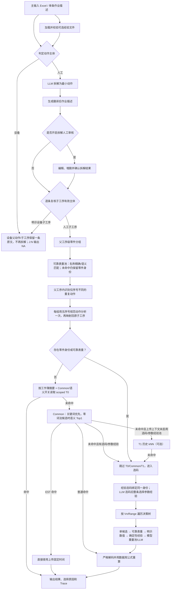

# STDS 工时分析系统

> 当前处理流程说明，基于 2026-08-05 的代码实现。

系统将自然语言作业描述拆解为最小人工动作，为每条动作选择 STDS
Chartcode 和参数，使用数据库公式确定性计算标准工时。当前流程同时支持：

- 从零件重量表检索可靠单重；表格未命中时，也能在一次分析中保持相同零件的模型重量判断一致；
- 随主输入上传 STDS 评估经验表，统一提供 Chartcode、参数和 Common Chart 经验；
- 让同一父工序内仅序号不同的重复动作共享一次分析决策；
- 对拆解结果进行人工审核；
- 输出 Chartcode、决策串、工时和可追溯的选择原因。

## 一、输入与数据源

### 1. 主输入 Excel

批量分析读取工作表 `数据表` 的 A:G：

| 列 | 字段 |
|---|---|
| A | 序号 |
| B | 项目名称 |
| C | 产品型号 |
| D | 产线 |
| E | 工位号 |
| F | 工位描述 |
| G | 作业描述 |

系统使用拆解后的原始描述进行工时分析，同时生成“翻译后作业描述”用于最终展示。

### 2. STDS 评估经验 Excel（可选）

在 Streamlit 页面中随主输入一起上传；API 也可先上传为经验上下文，再让 Job 引用。
支持三个工作表：

`chartcode选择经验`

| 字段 | 说明 |
|---|---|
| 操作内容 | 经验对应的动作身份 |
| 动作代码或参数选择 | Chartcode；兼容 V1.2 的列名 |
| 经验ID | 可选；建议提供，便于稳定绑定 |

`参数选择经验`

| 字段 | 说明 |
|---|---|
| 操作内容 | 经验对应的动作身份 |
| 动作代码 | Chartcode |
| 参数选择经验 | 按“参数V1：……、参数V2：……”描述 |
| 经验ID | 可选；存在时优先用于绑定 |

`Common_Chart`

| 字段 | 说明 |
|---|---|
| 操作内容 | Common 动作名称，用于展示和审计 |
| 决策描述 | 普通 Chartcode 的决策串；EST 行可为空，固定时间读取“时间”列 |
| 动作代码 | Chartcode，包括固定时间类型 `EST C00` / `EST V00` |
| 增值/非增值(C/V) | 必须与 Chartcode 属性一致 |
| 频率 | 必须为 `1`，每条拆分记录只计算一次 |
| 时间 | 普通行用于校验，EST 行作为固定时间来源 |
| 关键词描述1～8 | Common 快速匹配关键词；可为空，此时仍可按“操作内容”参与语义回退 |

Common Chart 只从当前上传文件的 `Common_Chart` 解析，不再从数据库自动加载。
未上传经验文件时，系统沿用普通 Chartcode 和参数选择流程；若 Common 开关开启，
则需先上传包含有效 `Common_Chart` 的经验文件。

### 3. 零件重量 Excel

默认由环境变量 `PART_WEIGHT_XLSX_PATH` 指定，表格需要包含：

- `Part No.`
- `English Description`
- `Chinese Description`
- `零件单重(KG)`

重量表在应用启动或会话初始化时加载。修改重量文件后，应重启应用或重新建立会话。

### 4. STDS 数据库

`DB_PATH` 指向 SQLite 数据库。当前计算图表从 `formula` 表加载；
`formula_chart` 用于公式一致性诊断，`stds_record` 保存历史记录。
数据库中的旧 `common_chart` 表不再作为运行时 Common 快捷路径的数据源。

只有存在于当前 `formula` 计算图表库中的 Chartcode，才能进入普通决策树计算。

## 二、当前完整处理流程



### Step 1：读取、归一化和复用输入

- 批量流程读取 `数据表` A:G。
- 相同原始作业描述会共用拆解结果，减少重复 LLM 调用。
- 同一父工序及其相同子工序序列会共用一次父工序重量解析结果。
- 同一次分析中的相同零件或可靠别名会共用同一条重量匹配结果。
- 重量表未命中但已识别零件名时，相同归一化零件名在同父工序和跨父工序中共用同一个模型重量判断。
- 同一父工序内仅序号不同的重复动作会共用一次规范动作分析结果。
- 并发度由 `CONCURRENCY_LIMIT` 控制。

### Step 2：判定人工或设备

系统先使用确定性规则判定动作主体，规则无法确定时调用 LLM。主体优先级为：

1. 句首有“操作人员”“人工”“工人”等明确人工主体，或英文 `Manual` 时，
   人工主体优先，即使同一句还提到机器人、AGV 或自动设备；
2. 否则，出现“自动”/`Auto`，或句首是“机器人”“机械手”“AGV”“设备”
   （前面可带数量和量词）时，判为明确设备动作；
3. 其余既有设备/人工动作关键词继续按规则判断；
4. 仍有歧义时才调用 LLM。

例如 `2个机器人拧紧65颗上盖螺栓，6±1Nm` 的句首主体是带数量和量词的
“机器人”，因此整条判为设备动作。设备父动作保持这一条原始描述，不调用人工动作
拆解，也不会按“2 个机器人”或“65 颗螺栓”展开或乘算。

- 设备父动作保持原描述，不进行人工动作拆解；
- 人工动作进入拆解；
- 人工审核后新增或修改的动作会重新进行主体判定。

设备动作不会套用人工 STDS 决策图，最终 Excel 的 J:N
（Decisions、Chart、C/V、Freq、Time）统一输出 `NA`。

### Step 3：拆解与翻译

- 人工动作由 LLM 拆解为最小可分析子工序；
- 拆解失败时回退为原始动作并标记待复核；
- 工时分析始终使用拆解原文；
- 翻译后的描述只用于展示和最终输出。

开启“人工审核拆解”后，流程在拆解和翻译完成时暂停。用户可以编辑、增删、
下载并重新上传拆解表，确认后再开始工时分析。

人工父动作完成拆解或审核后，系统还会逐条计算子工序的“有效主体”。若某条子工序
自身明确写有设备自主动作，它会覆盖从人工父动作继承的旧主体，例如
`设备自动拧紧上盖螺栓` 会按设备子工序处理；其他子工序继续继承父级主体。

### Step 4：父工序级零件识别与重量一致性

系统不是孤立地为每个子工序提取零件，而是把父工序和全部人工子工序一起交给 LLM，
识别同一个物理零件的连续操作链。

例如：

```text
父工序：人工A用吊具将Tray落位到toptooling小车

1. 人工A拿取吊具
2. 人工A移动吊具
3. 人工A用吊具夹持Tray
4. 人工A移动吊具
5. 人工A操作吊具落位Tray到toptooling小车上
6. 人工A操作吊具释放Tray
```

系统将第 3～6 条识别为同一个 `Tray` 操作链，并给它们传递完全相同的零件名称、
匹配记录和单重上下文。第 1～2 条属于夹持前的工具准备，不继承 `Tray` 重量。

一致性规则：

- 零件名称必须来自父工序或子工序原文，LLM 不得翻译或臆造；
- 同一零件组只检索一次重量，同组子工序复用同一个结果；
- 不同父工序命中相同零件时，也会从请求级重量池复用最早的可靠匹配；
- 表格未命中不会丢弃已验证的零件名；同组子工序共用同一个零件身份，供后续模型重量池使用；
- 一条子工序若同时被分给多个零件，视为歧义，不自动施加重量；
- 同一父工序包含多个零件时分别建立组，不强制共用重量；
- 明示设备子工序不送入零件提取，也不接收父工序重量上下文；
- 未能识别零件或零件归属有歧义时，不强行使用重量，回退后续普通选值逻辑。

### Step 5：零件重量表加载、去重与匹配

重量表的去重条件是以下四项全部完全一致：

```text
零件号 + 英文名称 + 中文名称 + 重量
```

只要其中任意一项不同，就保留为不同记录。完全重复的行合并，但保留全部来源位置。

名称匹配顺序：

1. 中文名或英文名归一化后的完全匹配；
2. 语义向量相似度匹配；
3. 未达到阈值、第一名优势不足或同名存在冲突重量时，返回未匹配。

当前默认语义阈值为 `0.85`，第一名相对下一候选的最小优势为 `0.05`。
长度不超过 4 的英文缩写只允许精确匹配，避免缩写误召回。

每次批量分析、单条分析或 API Job 都会创建独立的请求级可靠表重池（`PartWeightPool`）：

- 零件查询名先统一进行 NFKC、大小写、空格和标点归一化；
- 相同查询并发出现时只执行一次底层检索，其他工序等待并复用结果；
- 成功匹配和正常的“未匹配”都会在本次分析中缓存；
- 查询结果一旦写入便不再被后续别名覆盖，包括已确认的“未匹配”；
- 检索异常或任务取消不会写入缓存，后续工序可以重试；
- 命中后若有零件号则只以保留标点的零件号作为统一身份；没有零件号时才使用命中名称，
  因而中英文别名也可以复用同一条可靠重量；
- 缓存的是重量匹配记录，不是父工序的数值上下文。每个父工序仍保留自己的
  零件提取名、分组 ID 和 Trace，不会相互污染。

可靠表重池只在一次分析任务内共享；新的上传或 API Job 会创建新池，不会读取上一次任务
的旧重量结果。

如果 LLM 已在父工序级识别出零件名，但可靠表重池未取得数值，系统会保留
`PartIdentityContext`。后续遇到“全部候选均可解析为公斤档”的节点且已进入最终 LLM
回退时，再使用请求级 `ModelWeightPool`：

- 以保守归一化后的零件身份为 key，保存第一次模型选中的物理重量档，而不是某张图表的候选下标；
  身份只统一全半角、大小写和空白并保留连字符、斜杠等标点，因此 `P-1` 不会与 `P1` 合并；
  表重命中时优先使用规范零件号，其次使用命中名称；
- 同一零件在同一父工序的子工序之间、以及不同父工序之间复用该判断；
- 同一零件并发选值时执行 single-flight：只有一个调用让模型判断，其余调用等待并复用；
- 跨 Chartcode 映射先匹配相同公斤档，再匹配相同磅档（兼容 `1 lb = 0.45/0.4357 kg`
  等数据库换算差异），随后才按不低于缓存重量的最小档向上覆盖；
- 缓存重量超过当前 Chartcode 最大档时会临时选择最大档并强制标记人工复核，避免静默低估；
- 不同零件互不污染，新的上传任务或 API Job 使用新的 `Deps` 和新的模型重量池；
- 候选不是完整公斤档时不使用该池，沿用普通选值逻辑。

语义向量按需构建并保存在进程内存中，当前不需要独立向量数据库。

### Step 6：数量与重量规则

零件重量始终使用一个零件的单重：

- “拿取 3 个螺丝”只提取“螺丝”；
- 不执行 `单重 × quantity`；
- 设备描述中的主体数和加工数量也不参与工时乘法；例如
  `2个机器人拧紧65颗上盖螺栓，6±1Nm` 仍是一条设备记录，J:N 为 `NA`；
- 前置拆解已经把重复动作拆成独立子工序，批量工时分析时每条子工序按一次处理；
- 单条分析页面中用户显式填写的 `频率` 仍会用于最终工时计算，它与零件数量提取是两个概念。

当当前变量的全部候选都是公斤档时，可靠表重选择第一个不小于零件单重的重量档。
如果重量超过最大档、候选不是重量维度或单重无效，则不自动选档。
模型重量池只在单候选、可靠表重、描述中明示数值（重量节点上即显式重量）和
确定性参数经验都无法决定后介入。
两类重量都只用于选择当前节点的单次重量档，不乘零件数量，也不改写 `freq`。

### Step 7：父工序内重复动作一致性

取得父工序重量上下文后，系统会在当前父工序范围内识别仅序号或计数标记不同的动作。
例如：

```text
人工A拧紧冷板第一个螺栓
人工A拧紧冷板第二个螺栓
人工A拧紧冷板第三个螺栓
人工A拧紧冷板第四个螺栓
```

这四条会归一为 `人工A拧紧冷板螺栓`，只用该规范动作选择一次 Chartcode、
参数和单次工时，再把同一结果映射回四条原始子工序。

约束如下：

- 分组作用域仅限同一父工序，不跨无关父工序合并；
- 对准与拧紧、手工与拧紧枪等不同动作或工具不会合并；
- 扭矩、距离等明确工程数值会保留，`5 Nm` 与 `8 Nm` 不会合并；
- 不同零件重量或明示数值上下文不会共用分析结果；
- 明示设备子工序不进入重复人工动作一致性分组，而是始终保持原始单条动作；
- 每条输出仍保留原始子工序描述和独立记录；
- 分组数量不写入 `Freq`，也不参与工时乘法。四条 `Freq=1` 的记录各自保留
  同一个单次工时，只有汇总求和时才自然得到四次动作的总工时；
- Trace 写入一致性组 ID、规范动作和成员序号，便于追溯。

### Step 8：经验文件加载与校验

经验文件按 SHA-256 摘要区分版本。校验规则包括：

- 缺少 `chartcode选择经验`、缺少关键表头或文件无法读取：错误，暂停本次分析；
- Chartcode 不在当前计算图表库：警告，仅忽略对应经验行；
- Chartcode 选择经验和参数选择经验分别建立独立索引；
- 参数经验无需先绑定或命中对应的 Chartcode 选择经验；
- 参数经验按“操作内容 + Chartcode”建立动作身份，`经验ID` 用于稳定标识和冲突校验；
- 同一经验 ID 指向不同动作或 Chartcode：相关经验禁用；
- 同一动作和 Chartcode 存在互相冲突的参数规则：相关参数经验禁用；
- 未解析出任何 `参数Vn`，或 Vn 在目标 Chartcode 中不存在：对应提示不进入有效参数池；
- 参数默认值的单位或数值不在当前 Chartcode 候选中：只禁用对应 Vn，
  不影响该动作的其他经验；
- 行级警告不会阻塞其他有效经验。

`Common_Chart` 独立解析和校验：

- Common 结构错误只禁用 Common 快速路径，不连带禁用同一文件中的有效选码/参数经验；
- 普通行必须能按当前数据库图表严格解码，时间由数据库公式重新计算；上传时间只用于
  一致性校验，不一致时产生告警但以公式结果为准；
- 决策串会先规范化旧缩写，并在所有候选中先寻找精确 token，只有完全没有精确候选时
  才允许数值近似，低置信或歧义解码的行不会进入 Common；
- `EST C00` / `EST V00` 作为固定时间类型，不遍历普通公式；单次时间取
  `上传时间 / 源频率`，当前约束源频率必须为 `1`；
- C/V、时间、频率和关键词均逐行验证；单个无效关键词会被忽略；如果该行其他字段有效、
  “操作内容”非空，即使没有任何有效关键词也保留该行，使其可以参与 Common 语义回退。

UI 分别显示有效 Chartcode 选择经验、参数选择经验、Common_Chart 和其中 EST 固定时间
的数量。只要任一独立索引仍有有效记录，经验能力就可以继续工作；致命表结构错误仍会
暂停分析。更换上传经验文件会清除当前批量/单条结果状态，防止旧结果继续展示或复用。

当前 `STDS评估经验V1.2.xlsx` 校验结果为：41 条 Chartcode 选择经验、39 条参数经验、
25 条 Common（21 条公式行 + 4 条 EST 固定时间行）。其中 5 条普通 Common 的上传时间
与数据库公式重算值存在差异，保留为审计告警，运行时使用公式重算值。

API 使用两步上下文：

1. `POST /experience-contexts` 以 multipart 字段 `file` 上传 `.xlsx`，返回
   `experience_context_id`、完整文件摘要、有效条数和校验问题；
2. `POST /jobs` 在 JSON 中传 `experience_context_id`，并按需设置
   `use_common_chart=true`。`use_semantic_experience` 在 API 中默认是 `true`。

未上传上下文时，原有不使用经验的 `/jobs` JSON 调用仍兼容；若启用 Common 但未提供
有效上下文或文件中没有有效 `Common_Chart`，API 会拒绝启动任务。

### Step 9：经验语义检索与 Common 匹配

UI 和 API 的 `use_semantic_experience` 默认开启。该开关控制 Chartcode 经验的语义选码，
以及 Common 在关键词完全无候选时的语义回退；关闭它不会关闭 Common 关键词匹配，也不
会删除上传文件中的参数经验。该开关也进入 UI 运行签名；切换后旧批量/单条结果不会继续
作为当前配置的结果展示。

普通 Chartcode 经验选码只走语义向量 Top1：

1. 对全部有效 Chartcode 经验计算语义相似度；
2. Top1 分数 `>= 0.70` 即接受，不要求 Top1 与 Top2 之间存在 margin；
3. 同分时按 Excel 行号从小到大稳定选择；
4. 分数低于阈值、语义开关关闭或向量能力不可用时，回退普通 Chartcode LLM。

生产选码路径绝不再用操作内容的精确匹配或包含匹配直接决定 Chartcode。

Common 使用三级顺序：

```text
全候选归一化精确关键词
→ 没有精确项时，单向 keyword in input 的最长包含
→ 词法层完全没有候选时，语义 Top1（阈值 0.70）
```

Common 语义文档由“操作内容 + 全部有效关键词”组成；没有有效关键词但操作内容有效的行
仍参加语义 Top1。语义 Top1 不要求 margin，同分按 Common 的 Excel 行号稳定选择。
若精确或包含层已经出现候选但最高优先级指向不同输出，则属于关键词歧义，立即回退后续
Resolver 链路，不能再用语义分数覆盖。系统也不会使用 `input in keyword` 的反向包含。

Chartcode 与 Common 的向量均在当前上传请求的内存索引中首次需要时懒加载；并发首次
请求会合并构建，不需要向量数据库。Mock embedding 或远端 embedding 失败后降级得到的
占位向量不会产生语义命中，而是按上述规则回退。

参数经验的最小身份是“经验ID + 操作内容 + 已选 Chartcode”。参数上下文包含：

```text
参数经验ID + 操作内容 + 已选 Chartcode + 参数Vn经验 + 来源行
```

因此，即使“转身”和“弯腰”都使用 `202 010`：

- 转身只能读取转身的 V1/V2/V3 经验；
- 弯腰只能读取弯腰的 V1/V3 经验；
- 两者不会因为 Chartcode 相同而串用参数。

### Step 10：Chartcode 与整条参数经验选择

对于人工动作：

1. 语义开关开启时，先执行 Chartcode 经验语义 Top1；达到 `0.70` 时采用该行的码；
2. 未命中时调用 LLM 从当前计算图表库选择 Chartcode；
3. 若 Chartcode 来自经验，参数只能读取同一经验身份绑定的规则。即使同一 Chartcode
   下还有“转身/弯腰”等其他动作，也不能切换到另一身份；同一身份出现多条冲突规则时
   全部忽略，避免混用；
4. 若 Chartcode 来自 LLM，收集该码下全部有效参数经验：没有则沿用普通参数逻辑，只有
   一条则直接使用，多条则一次性全部交给 LLM 选择一整条；
5. 选中的唯一参数经验作为一个整体贯穿所有 Vn。遍历中只能读取这条记录对应 Vn 的提示，
   不能在不同 Vn 之间拼接多条参数经验；
6. 参数经验选择失败或 LLM 返回非法索引时不猜测第一条，直接回退普通参数逻辑；无法
   获得有效 Chartcode 时输出 unresolved 并进入人工复核。

因此，Chartcode 由 LLM 选择时参数经验仍全局生效，但“全局”表示所有同码候选都进入
一次整条选择，不表示各 Vn 可以从不同动作经验中自由取值。

在这些路径之前，Resolver 还会执行设备预检：只要 `machine_hint=True`，或操作原文
本身是明确设备动作，就立即返回 machine placeholder。即使上游错误继承了人工主体，
或缓存中已有同文本的人工结果，也不能泄漏到经验、公式、缓存或历史路径。

Resolver 的完整顺序是：

```text
设备预检
→ 解析零件身份与可靠表重上下文
→ scoped T0 精确缓存
→ 上传文件 Common_Chart（可选）
→ 上传上下文未启用选码/参数经验池时的 T1 历史 kNN
→ 人工/设备判定
→ Chartcode 经验语义 Top1@0.70 或 LLM
→ 按选码来源绑定/整条选择参数经验
→ 决策树遍历与公式计算
```

存在可靠表重或仅存在已验证零件身份时，都不会读取或写入完整动作缓存，并跳过
T0、Common 和 T1，直接进入选码和参数链路。这保证旧的动作级完整决策不会在到达
`ModelWeightPool` 之前提前返回并造成串档。上传经验不会
整体禁用 T0，而是把 T0 隔离到当前工作簿摘要对应的命名空间。Common 的命中优先于
T1；T1 只在上传上下文未启用选码/参数经验池时运行，避免历史完整决策绕过全局参数经验。
历史路径只复用 Chartcode 和决策串，时间仍使用当前数据库公式重新计算。

T0 的 scope 由“完整上传工作簿 SHA-256 摘要 + Common 开关 + 经验语义开关”共同组成。
切换工作簿或任一开关都不会读到另一决策环境的结果；缓存模板始终保存 `freq=1` 的
单次时间，命中后仅乘当前输入记录的显式 `freq`。

### Step 11：参数选择

决策树使用 `(VariableNumber, RangeNumber)` 读取当前节点候选，并按数据库中的
`next_variable`、`next_range` 前进，直到 `next_variable = 0`。

每个 Vn 的选择优先级：

1. **单候选**：直接选择；
2. **可靠表重**：当前节点是完整公斤档时，按零件单重选择重量档；
3. **操作描述中的明确数值**：如距离、重量、转速，提取描述中的全部数值事实，
   再匹配当前候选的对应维度；例如同时出现“移动 1m、重量 7kg”时，重量节点仍使用 7kg；
4. **当前动作、当前 Vn 的参数经验**：先尝试确定性选择；
   - 操作描述中的明确角度优先于经验默认角度；
   - 唯一且无条件的默认值可确定性选择；
   - 有条件分支的自然语言经验交给 LLM，并限制在当前候选内；
5. **最终 LLM 选择 / 模型重量池**：没有确定性结果时，由 LLM 从当前候选中选择。
   若已有零件身份且当前候选全是公斤档，这次最终回退由 `ModelWeightPool`
   单次决策并在同一 `Deps` 范围内复用；非重量节点仍执行普通 LLM 选值。

经验是辅助规则，不能覆盖操作描述中的明确事实。LLM 只返回候选下标，
实际公式值、决策缩写和跳转指针全部来自数据库。

### Step 12：公式计算与输出

普通 Chartcode 遍历结束后：

1. 将各 Vn 的 `formula_value` 代入当前 Chartcode 公式；
2. 使用受限 AST 进行确定性算术求值；
3. 得到单次标准时间；
4. 乘以输入中显式的 `freq`；
5. 输出 Chartcode、决策串、C/V、频率、时间和选择原因。

Common 中的 `EST C00` / `EST V00` 不走普通遍历，直接使用上传行的单次固定时间。
运行时不会再乘 Common 源频率，只把该单次时间乘当前输入记录的显式 `freq` 一次；
拆分出的多条记录仍各自是单次结果，不会把组成员数写成 `×N`。

设备父动作或设备子工序不执行上述公式步骤；批量输出的 J:N 统一为 `NA`。

Trace 会记录：

- 重复动作一致性组 ID、无序号规范动作和成员序号；
- `ExperienceChartcode`：命中的选码经验 ID、动作身份、匹配方式、文件和行号；
- `ExperienceParameter`：选码后命中的参数经验 ID、动作身份、匹配方式、文件和行号；
- 提取的零件名称、匹配名称、单重、相似度和重量表来源；表重未命中时记录零件身份、模型公斤档及首次选择/复用原因；
- 每个 Vn 的候选选择及原因；
- unresolved 或计算异常信息。

## 三、关键优先级汇总

```text
动作主体：
明确人工主体优先
→ 否则“自动”/Auto 或句首设备主体（可带数量和量词）
→ 其他规则
→ LLM

设备动作：
父动作保持一条原文；人工父动作的每个子工序再次检查有效主体
→ 设备子工序跳过重量、重复动作、经验、公式、缓存和历史路径
→ J:N 输出 NA

零件重量：
父工序级 LLM 分组 → 请求级可靠表重池 → 名称精确/语义匹配
→ 命中时复用可靠单重
→ 未命中但已识别零件时保留身份，在公斤候选的最终 LLM 回退中使用请求级模型重量池
→ 同父工序子步骤与跨父工序保持相同零件判断一致

重复动作：
同一父工序内去除序号后完全相同 → 规范动作分析一次 → 单次结果映射回各原始记录

Chartcode：
经验语义 Top1（`>=0.70`、无 margin、同分按 Excel 行）→ 未命中则 LLM

完整动作快速路径：
无零件身份且无可靠重量时，按“完整工作簿摘要 + Common开关 + 语义开关”读取 scoped T0
→ 上传 Common_Chart：关键词 exact → 最长单向 contains
→ 关键词完全无候选时语义 Top1@0.70；关键词歧义禁止语义覆盖
→ 仅在上传上下文未启用选码/参数经验池时尝试 T1

参数：
经验选码 → 严格绑定同一经验身份
LLM 选码 → 收集同码全部参数经验，单条直用，多条由 LLM 一次选择整条
→ 选中记录贯穿全部 Vn，禁止跨记录混用
→ 单候选 → 可靠表重 → 明示数值 → 当前动作/当前Vn确定性经验
→ 公斤候选节点使用模型重量池，其他节点由 LLM 选择

工时：
普通行：当前数据库公式确定性计算 × 输入记录显式频率
EST 固定时间：上传时间 / 源频率 × 输入记录显式频率（只乘一次）
```

## 四、当前限制

### EST C00 / EST V00

`EST C00` 和 `EST V00` 已支持两层兼容：

- 数据库中保留标准 `V1R1 → 5S → V0R0` 的单节点定义，使现有遍历器能够识别这两个
  Chartcode；
- 上传 `Common_Chart` 中的 EST 行按固定时间类型处理，直接以上传时间/源频率得到单次
  时间，不依赖普通公式重算。

普通 LLM 选码、向量候选和历史检索仍不会主动把 EST 当作一般动作图表；EST 只通过
经过严格校验的显式经验进入，避免固定时间类型被误选。

### 其他限制

- 经验文件可由 Streamlit 上传，也可经 API `POST /experience-contexts` 上传；API 上下文
  当前保存在单进程内存中，具有容量和有效期限制；
- 零件重量表目前通过配置路径加载，不随每次主输入上传；
- 可靠表重池和模型重量池都是单任务内存状态；它们保证同一批任务一致，不在不同上传或 API Job 之间共享；
- 零件和经验语义索引均保存在请求级内存中并按需懒加载，没有持久化向量库；
- Mock embedding 或远端 embedding 已降级为 Mock 时不会产生经验语义命中；
- 无法唯一确定零件、重量、动作经验或 Chartcode 时，系统选择回退或进入人工复核，
  不静默套用低置信结果。

## 五、配置与启动

常用环境变量：

| 变量 | 用途 |
|---|---|
| `DB_PATH` | STDS SQLite 数据库路径 |
| `PART_WEIGHT_XLSX_PATH` | 零件重量表路径 |
| `PART_WEIGHT_SIMILARITY_THRESHOLD` | 重量语义匹配阈值，默认 0.85 |
| `PART_WEIGHT_SIMILARITY_MARGIN` | 重量语义第一名优势，默认 0.05 |
| `LLM_BACKEND` | `auto`、`vllm`、`deepseek`、`ark`、`custom`、`ollama` 或 `mock` |
| `EMBED_BACKEND` | 独立向量后端：`auto`、`vllm`、`ark`、`custom`、`ollama` 或 `mock` |
| `VLLM_EMBED_BASE_URL` | 可选的独立 vLLM embedding `/v1` 地址 |
| `VLLM_EMBED_MODEL` | vLLM embedding 模型名 |
| `EMBED_MODEL` | Ollama embedding 模型名 |
| `DEEPSEEK_API_BASE_URL` | DeepSeek OpenAI 兼容接口，默认 `https://api.deepseek.com` |
| `DEEPSEEK_API_KEY` | DeepSeek API Key |
| `DEEPSEEK_LLM_MODEL` | DeepSeek 模型，默认 `deepseek-v4-flash` |
| `ARK_API_BASE_URL` | 火山引擎方舟推理地址，默认北京区域 `/api/v3` |
| `ARK_API_KEY` | 方舟推理使用的单一 Bearer API Key |
| `ARK_LLM_MODEL` | 方舟聊天 Model ID 或 `ep-...` Endpoint ID |
| `ARK_EMBED_API_KEY` | 可选的独立向量 Key；留空时复用 `ARK_API_KEY` |
| `ARK_EMBED_MODEL` | 方舟向量 Model ID 或 Endpoint ID |
| `ARK_EMBED_MODE` | `text`（标准文本向量）或 `multimodal`（视觉向量接口） |
| `CONCURRENCY_LIMIT` | 批量并发数 |

DeepSeek 配置示例：

```dotenv
LLM_BACKEND=deepseek
DEEPSEEK_API_BASE_URL=https://api.deepseek.com
DEEPSEEK_API_KEY=sk-请替换为你的密钥
DEEPSEEK_LLM_MODEL=deepseek-v4-flash
```

DeepSeek 后端使用 OpenAI 兼容的 `/chat/completions` 和 JSON Output。DeepSeek
官方当前未提供 embedding 接口，因此语义向量仍需由已有 vLLM、自定义 API 或 Ollama
提供。`EMBED_BACKEND` 与 `LLM_BACKEND` 相互独立，例如可同时使用
`LLM_BACKEND=deepseek` 和 `EMBED_BACKEND=ollama`；Mock 仅用于确定性降级，
不会产生业务语义命中。

### 火山引擎方舟

方舟聊天使用 OpenAI 兼容的 `POST /chat/completions`。所有现有 LLM 任务——动作
拆分、零件提取、Chartcode 选择和参数选择——都通过统一客户端调用，因此只需切换
后端配置：

```dotenv
LLM_BACKEND=ark
ARK_API_BASE_URL=https://ark.cn-beijing.volces.com/api/v3
ARK_API_KEY=请填写轮换后的单一方舟APIKey
ARK_LLM_MODEL=请填写Model-ID或ep-Endpoint-ID
```

`AccessKeyId / SecretAccessKey` 属于火山 OpenAPI 管理面签名凭证，不能直接拼接或
传给推理客户端。运行时只读取一个 `ARK_API_KEY`，密钥不进入 UI、API Job 请求、
数据库或日志。聊天请求默认不发送并非所有方舟模型都承诺支持的
`response_format`；现有 JSON Schema 提示词、JSON 解析和 Pydantic 校验继续保证结构。

语义检索可以独立切到方舟。标准文本向量接口会自动按 256 条分批，并保持原始顺序：

```dotenv
EMBED_BACKEND=ark
ARK_EMBED_MODEL=请填写文本向量Model-ID或Endpoint-ID
ARK_EMBED_MODE=text
```

如果使用 Doubao 视觉向量模型，则改为 `ARK_EMBED_MODE=multimodal`，项目会调用
`/embeddings/multimodal` 并按其专用输入格式逐条处理纯文本。任意一批远端向量失败
时，整批结果会被标记为不可用于语义决策；Chartcode、Common Chart、参数经验和零件
重量都不会把降级 Mock 向量当成真实匹配。

真实联网冒烟测试默认跳过，避免普通测试产生费用。确认已使用轮换后的 Key 并配置
模型/Endpoint 后，可显式执行：

```bash
RUN_ARK_SMOKE=1 .venv/bin/python -m pytest -q tests/live/test_ark_smoke.py
```

启动 Streamlit：

```bash
cd /Users/wangyushan/Desktop/stds_project
.venv/bin/python -m streamlit run stds/ui/app.py
```

运行单元测试：

```bash
.venv/bin/python -m pytest -q tests/unit
```
