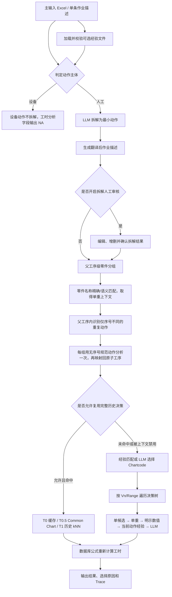

# STDS 工时分析系统

> 当前处理流程说明，基于 2026-07-29 的代码实现。

系统将自然语言作业描述拆解为最小人工动作，为每条动作选择 STDS
Chartcode 和参数，使用数据库公式确定性计算标准工时。当前流程同时支持：

- 从零件重量表检索单重，辅助重量参数选择；
- 随主输入上传 STDS 评估经验表，辅助 Chartcode 和参数选择；
- 让同一父工序内仅序号不同的重复动作共享一次分析决策；
- 对拆解结果进行人工审核；
- 输出 Chartcode、决策串、工时和可追溯的选择原因。

## 一、输入与数据源

### 1. 主输入 Excel

批量分析读取工作表 `数据表` 的 A:G：

| 列 | 字段 |
|---|---|
| A | 序号 |
| B | 项目名称 |
| C | 产品型号 |
| D | 产线 |
| E | 工位号 |
| F | 工位描述 |
| G | 作业描述 |

系统使用拆解后的原始描述进行工时分析，同时生成“翻译后作业描述”用于最终展示。

### 2. STDS 评估经验 Excel（可选）

在 Streamlit 页面中随主输入一起上传。支持两个工作表：

`chartcode选择经验`

| 字段 | 说明 |
|---|---|
| 操作内容 | 经验对应的动作身份 |
| 动作代码或参数选择 | Chartcode；兼容 V1.2 的列名 |
| 经验ID | 可选；建议提供，便于稳定绑定 |

`参数选择经验`

| 字段 | 说明 |
|---|---|
| 操作内容 | 经验对应的动作身份 |
| 动作代码 | Chartcode |
| 参数选择经验 | 按“参数V1：……、参数V2：……”描述 |
| 经验ID | 可选；存在时优先用于绑定 |

不上传经验文件时，系统完全沿用普通 Chartcode 和参数选择流程。

### 3. 零件重量 Excel

默认由环境变量 `PART_WEIGHT_XLSX_PATH` 指定，表格需要包含：

- `Part No.`
- `English Description`
- `Chinese Description`
- `零件单重(KG)`

重量表在应用启动或会话初始化时加载。修改重量文件后，应重启应用或重新建立会话。

### 4. STDS 数据库

`DB_PATH` 指向 SQLite 数据库。当前计算图表从 `formula` 表加载；
`formula_chart` 用于公式一致性诊断，`common_chart` 用于可选快捷路径，
`stds_record` 保存历史记录。

只有存在于当前 `formula` 计算图表库中的 Chartcode，才能进入普通决策树计算。

## 二、当前完整处理流程



### Step 1：读取、归一化和复用输入

- 批量流程读取 `数据表` A:G。
- 相同原始作业描述会共用拆解结果，减少重复 LLM 调用。
- 同一父工序及其相同子工序序列会共用一次父工序重量解析结果。
- 同一父工序内仅序号不同的重复动作会共用一次规范动作分析结果。
- 并发度由 `CONCURRENCY_LIMIT` 控制。

### Step 2：判定人工或设备

系统先使用关键词规则判定动作主体，规则无法确定时调用 LLM：

- 设备动作保持原描述，不进行人工动作拆解；
- 人工动作进入拆解；
- 人工审核后新增或修改的动作会重新进行主体判定。

设备动作不会套用人工 STDS 决策图，最终分析字段输出 `NA`。

### Step 3：拆解与翻译

- 人工动作由 LLM 拆解为最小可分析子工序；
- 拆解失败时回退为原始动作并标记待复核；
- 工时分析始终使用拆解原文；
- 翻译后的描述只用于展示和最终输出。

开启“人工审核拆解”后，流程在拆解和翻译完成时暂停。用户可以编辑、增删、
下载并重新上传拆解表，确认后再开始工时分析。

### Step 4：父工序级零件识别与重量一致性

系统不是孤立地为每个子工序提取零件，而是把父工序和全部子工序一起交给 LLM，
识别同一个物理零件的连续操作链。

例如：

```text
父工序：人工A用吊具将Tray落位到toptooling小车

1. 人工A拿取吊具
2. 人工A移动吊具
3. 人工A用吊具夹持Tray
4. 人工A移动吊具
5. 人工A操作吊具落位Tray到toptooling小车上
6. 人工A操作吊具释放Tray
```

系统将第 3～6 条识别为同一个 `Tray` 操作链，并给它们传递完全相同的零件名称、
匹配记录和单重上下文。第 1～2 条属于夹持前的工具准备，不继承 `Tray` 重量。

一致性规则：

- 零件名称必须来自父工序或子工序原文，LLM 不得翻译或臆造；
- 同一零件组只检索一次重量，同组子工序复用同一个结果；
- 一条子工序若同时被分给多个零件，视为歧义，不自动施加重量；
- 同一父工序包含多个零件时分别建立组，不强制共用重量；
- 无法可靠识别或匹配时不强行使用重量，回退后续普通选值逻辑。

### Step 5：零件重量表加载、去重与匹配

重量表的去重条件是以下四项全部完全一致：

```text
零件号 + 英文名称 + 中文名称 + 重量
```

只要其中任意一项不同，就保留为不同记录。完全重复的行合并，但保留全部来源位置。

名称匹配顺序：

1. 中文名或英文名归一化后的完全匹配；
2. 语义向量相似度匹配；
3. 未达到阈值、第一名优势不足或同名存在冲突重量时，返回未匹配。

当前默认语义阈值为 `0.85`，第一名相对下一候选的最小优势为 `0.05`。
长度不超过 4 的英文缩写只允许精确匹配，避免缩写误召回。

语义向量按需构建并保存在进程内存中，当前不需要独立向量数据库。

### Step 6：数量与重量规则

零件重量始终使用一个零件的单重：

- “拿取 3 个螺丝”只提取“螺丝”；
- 不执行 `单重 × quantity`；
- 前置拆解已经把重复动作拆成独立子工序，批量工时分析时每条子工序按一次处理；
- 单条分析页面中用户显式填写的 `频率` 仍会用于最终工时计算，它与零件数量提取是两个概念。

当当前变量的全部候选都是公斤档时，系统选择第一个不小于零件单重的重量档。
如果重量超过最大档、候选不是重量维度或单重无效，则不自动选档。

### Step 7：父工序内重复动作一致性

取得父工序重量上下文后，系统会在当前父工序范围内识别仅序号或计数标记不同的动作。
例如：

```text
人工A拧紧冷板第一个螺栓
人工A拧紧冷板第二个螺栓
人工A拧紧冷板第三个螺栓
人工A拧紧冷板第四个螺栓
```

这四条会归一为 `人工A拧紧冷板螺栓`，只用该规范动作选择一次 Chartcode、
参数和单次工时，再把同一结果映射回四条原始子工序。

约束如下：

- 分组作用域仅限同一父工序，不跨无关父工序合并；
- 对准与拧紧、手工与拧紧枪等不同动作或工具不会合并；
- 扭矩、距离等明确工程数值会保留，`5 Nm` 与 `8 Nm` 不会合并；
- 不同零件重量或明示数值上下文不会共用分析结果；
- 每条输出仍保留原始子工序描述和独立记录；
- 分组数量不写入 `Freq`，也不参与工时乘法。四条 `Freq=1` 的记录各自保留
  同一个单次工时，只有汇总求和时才自然得到四次动作的总工时；
- Trace 写入一致性组 ID、规范动作和成员序号，便于追溯。

### Step 8：经验文件加载与校验

经验文件按 SHA-256 摘要区分版本。校验规则包括：

- 缺少 `chartcode选择经验`、缺少关键表头或文件无法读取：错误，暂停本次分析；
- Chartcode 不在当前计算图表库：警告，仅忽略对应经验行；
- 参数经验优先按 `经验ID` 绑定；没有 ID 时按“操作内容 + Chartcode”唯一绑定；
- 同一经验 ID 指向不同动作或 Chartcode：相关经验禁用；
- 同一动作身份存在互相冲突的参数经验：相关参数经验禁用；
- 参数默认值的单位或数值不在当前 Chartcode 候选中：只禁用对应 Vn，
  不影响该动作的其他经验；
- 行级警告不会阻塞其他有效经验。

UI 显示的“有效动作经验”数量来自 `chartcode选择经验` 通过校验后形成的动作记录数。
`参数选择经验` 是附加到动作记录上的规则，不会再单独计数。
如果文件中的动作经验全部无效，最终没有可用经验索引，UI 会暂停分析并要求修复或移除该文件。

### Step 9：动作经验匹配

动作经验的匹配顺序：

1. 归一化完全匹配；
2. 最长包含匹配；
3. 语义相似度回退。

只有结果唯一、超过相似度阈值并且与下一候选拉开足够差距时才使用经验。
存在并列或歧义时不强行选择，回退普通流程。

经验的最小作用域是“动作身份”，不是 Chartcode。完整上下文包含：

```text
经验ID + 操作内容 + Chartcode + 参数Vn经验 + 来源行
```

因此，即使“转身”和“弯腰”都使用 `202 010`：

- 转身只能读取转身的 V1/V2/V3 经验；
- 弯腰只能读取弯腰的 V1/V3 经验；
- 两者不会因为 Chartcode 相同而串用参数。

### Step 10：Chartcode 选择

对于人工动作：

1. 先尝试匹配唯一可靠的完整动作经验；
2. 命中时直接使用该动作经验的 Chartcode，并保留同一份动作身份上下文；
3. 未命中时调用 LLM 从当前计算图表库选择 Chartcode；
4. LLM 确定 Chartcode 后，可在该 Chartcode 内再次约束匹配参数经验；
5. 仍无法获得有效 Chartcode 时输出 unresolved，并进入人工复核。

经验开启或父工序重量上下文已经解析时，系统跳过可能复用整条旧决策的
T0 缓存、T0.5 Common Chart 和 T1 历史 kNN，避免旧结果绕过本次重量或经验规则。

在没有这些决策上下文时，快捷路径仍按以下顺序工作：

```text
T0 精确缓存 → T0.5 Common Chart（可选）→ T1 历史 kNN → T2/T3/T4
```

历史路径只复用 Chartcode 和决策串，时间仍使用当前数据库公式重新计算。

### Step 11：参数选择

决策树使用 `(VariableNumber, RangeNumber)` 读取当前节点候选，并按数据库中的
`next_variable`、`next_range` 前进，直到 `next_variable = 0`。

每个 Vn 的选择优先级：

1. **单候选**：直接选择；
2. **零件单重**：当前节点是完整公斤档时，按单重选择重量档；
3. **操作描述中的明确数值**：如距离、重量、转速，匹配最近的同维度候选；
4. **当前动作、当前 Vn 的经验**：
   - 操作描述中的明确角度优先于经验默认角度；
   - 唯一且无条件的默认值可确定性选择；
   - 有条件分支的自然语言经验交给 LLM，并限制在当前候选内；
5. **普通 LLM 选择**：没有可用经验时，由 LLM 从当前候选中选择。

经验是辅助规则，不能覆盖操作描述中的明确事实。LLM 只返回候选下标，
实际公式值、决策缩写和跳转指针全部来自数据库。

### Step 12：公式计算与输出

遍历结束后：

1. 将各 Vn 的 `formula_value` 代入当前 Chartcode 公式；
2. 使用受限 AST 进行确定性算术求值；
3. 得到单次标准时间；
4. 乘以输入中显式的 `freq`；
5. 输出 Chartcode、决策串、C/V、频率、时间和选择原因。

Trace 会记录：

- 重复动作一致性组 ID、无序号规范动作和成员序号；
- 命中的经验 ID、动作身份、匹配方式、文件和行号；
- 提取的零件名称、匹配名称、单重、相似度和重量表来源；
- 每个 Vn 的候选选择及原因；
- unresolved 或计算异常信息。

## 三、关键优先级汇总

```text
动作主体：
规则 → LLM

零件重量：
父工序级 LLM 分组 → 名称精确匹配 → 语义匹配 → 无可靠结果则放弃

重复动作：
同一父工序内去除序号后完全相同 → 规范动作分析一次 → 单次结果映射回各原始记录

Chartcode：
唯一动作经验 → LLM → 在已选 Chartcode 内补绑参数经验

参数：
单候选 → 零件单重 → 明示数值 → 当前动作/当前Vn经验 → LLM

工时：
当前数据库公式确定性计算 × 显式频率
```

## 四、当前限制

### EST C00 / EST V00

当前数据库的 `stds_record` 中存在 `EST C00`、`EST V00` 历史记录，
但 `formula` 和 `formula_chart` 中没有对应的计算图表定义。

因此它们目前：

- 不能作为普通决策树 Chartcode 执行；
- 在经验文件中会被标记为无效 Chartcode 并忽略；
- 不会影响其他有效经验继续加载。

若要支持，应新增“直接输入时间”的特殊 EST 处理流程，或者补充完整的计算图表定义。
在该能力实现前，不能仅因为历史表中存在代码就将其视为可计算图表。

### 其他限制

- 经验文件上传目前集成在 Streamlit 页面流程中；
- 零件重量表目前通过配置路径加载，不随每次主输入上传；
- 零件和经验语义索引均保存在内存中，没有持久化向量库；
- 无法唯一确定零件、重量、动作经验或 Chartcode 时，系统选择回退或进入人工复核，
  不静默套用低置信结果。

## 五、配置与启动

常用环境变量：

| 变量 | 用途 |
|---|---|
| `DB_PATH` | STDS SQLite 数据库路径 |
| `PART_WEIGHT_XLSX_PATH` | 零件重量表路径 |
| `PART_WEIGHT_SIMILARITY_THRESHOLD` | 重量语义匹配阈值，默认 0.85 |
| `PART_WEIGHT_SIMILARITY_MARGIN` | 重量语义第一名优势，默认 0.05 |
| `LLM_BACKEND` | `auto`、`vllm`、`custom`、`ollama` 或 `mock` |
| `CONCURRENCY_LIMIT` | 批量并发数 |

启动 Streamlit：

```bash
cd /Users/wangyushan/Desktop/stds_project
.venv/bin/python -m streamlit run stds/ui/app.py
```

运行单元测试：

```bash
.venv/bin/python -m pytest -q tests/unit
```
