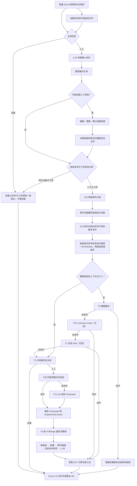

# STDS 全链路决策逻辑

> 当前技术流程说明，基于 2026-07-29 的代码实现。
> 项目入口、输入格式和启动方式同时参见 [README.md](README.md)。

## 一句话总结

```text
输入作业描述
→ 判定人工/设备
→ 人工动作拆解与翻译
→ 逐条复核拆解子工序的有效主体
→ 父工序级零件分组和单重匹配
→ 父工序内重复动作归一并共享一次决策
→ 动作经验或 LLM 选择 Chartcode
→ 按当前动作身份逐个 Vn 选择参数
→ 数据库公式确定性计算
→ 输出结果、选择原因和 Trace
```

## 一、核心原则

当前实现遵循以下原则：

1. Chartcode、参数候选、公式值和跳转指针必须来自当前数据库；
2. LLM 用于语义理解、拆解、零件提取和候选选择，不负责口算公式；
3. 零件重量使用单重，不从描述中提取数量参与乘法；
4. 同一父工序拆出的同一零件操作链共享完全相同的重量上下文；
5. 同一父工序内仅序号不同的重复动作共享 Chartcode、参数和单次工时；
6. 重复动作的条数不写入 `freq`，每条记录仍按一次动作独立输出；
7. 参数经验按动作身份隔离，不能仅按 Chartcode 横向复用；
8. 操作描述中的明确事实优先于经验默认值；
9. 匹配不唯一、置信不足或数据冲突时回退，不静默套用结果；
10. 明确设备动作在任何缓存、经验、重量或公式路径之前短路返回；
11. 每个关键选择都写入 Trace，便于审计和人工复核。

## 二、输入与运行上下文

### 2.1 批量输入

批量入口读取 Excel 工作表 `数据表` 的 A:G：

| 列 | 字段 |
|---|---|
| A | 序号 |
| B | 项目名称 |
| C | 产品型号 |
| D | 产线 |
| E | 工位号 |
| F | 工位描述 |
| G | 作业描述 |

系统保留拆解原文用于工时分析，并生成“翻译后作业描述”用于展示和最终输出。

### 2.2 单条输入

单条分析接受：

```python
operation_des  # 原始作业描述
line_name      # 项目名称
station_op     # 工位
freq           # 用户显式填写的频率
```

单条输入同样先经过主体判定、拆解、翻译、父工序重量分组和重复动作一致性处理，
再逐条返回子工序结果。

### 2.3 零件重量上下文

零件重量表由 `PART_WEIGHT_XLSX_PATH` 指定，加载后形成进程内
`PartWeightIndex`。它不是随每次主输入上传的文件。

### 2.4 STDS 经验上下文

Streamlit 页面允许随主输入上传一份可选经验 Excel。文件通过校验后形成请求级
`ExperienceIndex`，并使用文件 SHA-256 摘要标识版本。

不上传经验文件时，经验链路不参与分析。

### 2.5 STDS 计算图表

当前 `MostChart` 从 SQLite 数据库 `formula` 表加载，内存结构为：

```python
MostChart(
    chartcode: str,
    title: str,
    formula: str,
    value_added: bool,
    developed_in_seconds: bool,
    options: {
        (VariableNumber, RangeNumber): [ValueOption, ...]
    },
)
```

`ValueOption` 中保存：

```python
variable_number
range_number
value_number
description
metric_abbrev
formula_value
next_variable
next_range
```

只有存在于当前 `formula` 图表库中的 Chartcode，才能进入普通决策树计算。

## 三、总流程图



## 四、阶段 A：主体判定、拆解和翻译

### A1. 主体判定

系统先调用关键词规则：

```text
明确人工主体（含 Manual）优先
→ 否则“自动”/Auto 或句首设备主体（可带数量和量词）
→ 其他设备关键词
→ 人工动作关键词
→ 无法确定时调用 LLM
```

输出只有两类：

- `人工`
- `设备`

句首明确人工主体的优先级最高，即使句中同时出现机器人、AGV 或自动设备，也按人工动作
继续判断。没有句首明确人工主体时，出现“自动”/`Auto`，或句首出现“机器人”“机械手”
“AGV”“设备”（前面可带数字/中文数词及“个、台、套、组、辆、部、只”等量词），
就是明确设备自主动作。

```text
2个机器人拧紧65颗上盖螺栓，6±1Nm
→ 句首为带数量和量词的机器人主体
→ 设备
```

### A2. 设备动作

设备动作：

- 设备父动作保持一条原始动作，不进入人工动作拆解；
- 主体数、零件数或加工数量不展开，也不参与数量乘法；
- 不进入零件重量提取、重复人工动作一致性、经验、人工 STDS 决策树、公式、
  T0 缓存、T0.5 Common Chart 或 T1 历史 kNN；
- 内部返回 machine placeholder；
- 最终 Excel 的 J:N，即 Decisions、Chart、C/V、Freq、Time 字段统一输出 `NA`。

因此上例仍只保留一条
`2个机器人拧紧65颗上盖螺栓，6±1Nm`，不会生成 65 条人工拧紧动作，也不会计算
`单次工时 × 65`。

### A3. 人工动作拆解

人工动作调用 LLM 拆成最小可分析子工序。

```text
输入：人工A用吊具将Tray落位到toptooling小车

可能拆为：
1. 人工A拿取吊具
2. 人工A移动吊具
3. 人工A用吊具夹持Tray
4. 人工A移动吊具
5. 人工A操作吊具落位Tray到toptooling小车上
6. 人工A操作吊具释放Tray
```

拆解失败或返回空结果时：

- 回退为原始动作；
- 标记拆解阶段需要人工复核；
- 保存异常信息。

### A4. 批量复用

批量输入中，归一化后相同的父作业描述只拆解一次，再把拆解结果复用到相同行。

### A5. 翻译

系统对唯一的拆解动作生成翻译文本：

- 拆解原文是工时分析的真实输入；
- 翻译文本只用于展示和输出；
- 同一拆解原文只翻译一次。

### A6. 可选人工审核

开启“人工审核拆解”后，流程在拆解和翻译结束时暂停。

用户可以：

- 修改动作；
- 新增动作；
- 删除动作；
- 下载拆解文件；
- 上传修改后的拆解文件；
- 确认后继续。

人工审核后新增或修改的动作会重新进行主体判定，但不会再次自动拆解。

无论是否审核，人工父动作的每条拆解子工序还会计算“有效主体”：

```text
子工序自身是明确设备动作 → 有效主体=设备
否则 → 继承父工序主体
```

这一步允许 `设备自动拧紧上盖螺栓` 等子工序覆盖已继承的人工父主体。设备子工序
不会被重新拆解，并在后续各阶段都按设备隔离处理。

## 五、阶段 B：父工序级零件重量处理

### B1. 为什么在父工序级处理

如果逐条对子工序提取零件：

```text
夹持Tray → 可以提取 Tray
移动吊具 → 只能看到吊具，无法知道正在承载 Tray
落位Tray → 可以提取 Tray
```

这会造成同一物理零件链中的子工序使用不同重量。

当前实现把父工序和全部人工子工序一次性交给 LLM，识别“同一个物理零件”的连续操作链；
明示设备子工序会在调用前剔除。

### B2. LLM 零件分组

LLM 返回：

```python
PartOperationGroup(
    part_name="Tray",
    child_indexes=[3, 4, 5, 6],
    reason="同一吊运链",
)
```

约束：

1. `part_name` 必须是父工序或子工序原文中的连续文字；
2. 不得翻译、补充或猜测零件号；
3. 工具准备动作不继承尚未夹持的零件重量；
4. 承接同一负载的工具动作可以加入该零件组；
5. 一个父工序包含多个零件时分别建组；
6. 同一个 `child_index` 不能可靠属于多个组；
7. 明示设备子工序在调用 LLM 前已从子工序列表中剔除，不提取零件、不接收重量上下文；
8. 无法确认的子工序不分组。

### B3. 歧义处理

若一个子工序被分给多个零件：

- 删除该子工序的自动重量上下文；
- 不选择任意一个零件；
- 后续参数选择回退普通逻辑。

### B4. 重量表严格去重

重量表只有以下四项全部完全一致才视为重复：

```text
Part No.
+ English Description
+ Chinese Description
+ 零件单重(KG)
```

完全重复的记录保留第一条逻辑记录，并合并所有来源单元格。

以下情况都不去重：

- 零件号不同；
- 英文名称不同；
- 中文名称不同；
- 重量不同。

### B5. 名称匹配

匹配顺序：

```text
归一化完全匹配
→ 语义向量相似度匹配
→ 无可靠结果
```

归一化只用于匹配，不用于严格去重。

语义匹配默认要求：

- 相似度不低于 `0.85`；
- 第一名相对下一不同记录至少领先 `0.05`；
- 长度不超过 4 的英文缩写只允许精确匹配；
- 同一个名称对应多个不同正重量时视为冲突，不返回重量。

向量在首次需要语义匹配时按需构建并缓存在进程内存，不依赖独立向量数据库。

### B6. 单重规则

描述中的数量被忽略：

```text
“拿取3个螺丝” → part_name = “螺丝” → 使用螺丝单重
```

不执行：

```text
单重 × quantity
```

原因是前置拆解会把重复执行拆为独立动作，批量分析中的每条拆解子工序按一次处理。

单条页面中用户显式填写的 `freq` 仍参与最终工时计算。`freq` 是调用参数，
不是从零件数量推断出的数量。

### B7. 共享重量上下文

一个可靠重量命中转换为：

```python
NumericContext(
    weight_kg=...,
    query_name=...,
    matched_name=...,
    similarity=...,
    match_type=...,
    source=...,
    group_id=...,
)
```

同一零件组中的全部子工序复用同一个 `NumericContext` 对象，所以零件名、
匹配记录、单重和来源保持一致。

批量分析的结果复用键还包含：

```text
主体
+ 子工序文本
+ 父重量解析作用域
+ 当前 NumericContext
```

因此，相同子工序文本出现在不同父工序或不同零件组中时，不会错误复用另一组的重量结果。

### B8. 重复动作一致性

系统在每个父工序内部，将只因序号或计数词不同而产生的子工序归为一致性组：

```text
人工A拧紧冷板第一个螺栓
人工A拧紧冷板第二个螺栓
人工A拧紧冷板第三个螺栓
人工A拧紧冷板第四个螺栓
```

规范动作是：

```text
人工A拧紧冷板螺栓
```

系统用规范动作调用一次 Resolver，再把相同的 Chartcode、Decisions 和单次工时
复制回全部原始子工序。输出描述仍保留“第一、第二、第三、第四”等原文。

分组键保留动作词、工具和工程数值，并叠加当前重量/数值上下文。因此：

- “对准螺栓”与“拧紧螺栓”分属不同组；
- “手工拧紧”与“用拧紧枪拧紧”分属不同组；
- `5 Nm` 与 `8 Nm` 不会合并；
- 不同 `NumericContext` 不会共用分析结果；
- 明示设备子工序不进入一致性组，保持原始单条动作；
- 组只在当前父工序内有效，不跨无关父工序传播。

一致性组不代表频率。若四条记录的 `freq` 都是 `1`，每条记录都保存同一个单次工时，
不会产生某一条 `×4` 的结果；父工序总工时才会通过四条记录求和自然得到四次动作工时。

## 六、阶段 C：经验文件加载与动作身份

### C1. 工作表结构

经验文件包含：

`chartcode选择经验`

| 字段 | 用途 |
|---|---|
| 操作内容 | 动作身份 |
| 动作代码或参数选择 | Chartcode |
| 经验ID | 可选的稳定身份 |

`参数选择经验`

| 字段 | 用途 |
|---|---|
| 操作内容 | 动作身份 |
| 动作代码 | Chartcode |
| 参数选择经验 | 按 Vn 编写的自然语言规则 |
| 经验ID | 可选；存在时优先绑定 |

### C2. Chartcode 经验加载

每一行先执行：

1. 归一化操作内容；
2. 归一化 Chartcode；
3. 检查 Chartcode 是否存在于当前计算图表库；
4. 生成或读取经验 ID；
5. 排除冲突和完全重复身份。

没有显式经验 ID 时，系统生成：

```text
auto:{归一化操作内容}|{归一化Chartcode}
```

### C3. 参数经验绑定

参数经验按以下顺序绑定：

1. 存在 `经验ID` 时，按“经验ID + Chartcode”绑定；
2. 没有 `经验ID` 时，按“操作内容 + Chartcode”唯一绑定；
3. 无法唯一绑定时忽略该参数经验。

参数文本会拆成：

```python
variable_hints = {
    1: "参数V1的经验",
    2: "参数V2的经验",
    3: "参数V3的经验",
}
```

### C4. 校验级别

错误会暂停分析：

- 无法读取工作簿；
- 缺少 `chartcode选择经验`；
- 缺少关键表头；
- 校验后没有任何可用动作经验。

警告只影响对应行或变量：

- Chartcode 不在当前图表库；
- 操作内容为空；
- 经验 ID 冲突；
- 参数经验无法唯一绑定；
- 同一动作身份存在冲突参数经验；
- 参数单位或默认值不在当前 Vn 候选中。

参数值不合法时只删除对应 Vn 提示，不删除该动作的其他有效经验。

### C5. 有效经验计数

UI 显示：

```text
len(experience_index.records)
```

这是有效动作经验数量，不是两个工作表行数之和。

`参数选择经验` 是附加规则，不独立形成第二条动作记录。

### C6. 动作经验匹配顺序

分析动作时：

```text
归一化完全匹配
→ 最长包含匹配
→ 语义相似度匹配
```

精确或包含匹配如果出现多个不同身份并列，直接返回未匹配，不使用语义分数强行打破冲突。

语义匹配只有在：

- 分数达到阈值；
- 第一名与下一不同经验拉开足够差距；
- 结果属于唯一身份；

时才返回 `ExperienceContext`。

### C7. 为什么不能只按 Chartcode 取参数

`202 010` 可以同时表示转身和弯腰相关动作：

```text
转身 → V1=Turn，V2=转身角度，V3=No Bend
弯腰 → V1=No Twist or Turn，V3=弯腰角度
```

如果只按 `202 010` 查参数，转身可能读取弯腰默认值。

当前流程始终传递完整上下文：

```python
ExperienceContext(
    experience_id=...,
    operation_label=...,
    chartcode=...,
    match_type=...,
    chart_row=...,
    parameter_row=...,
    variable_hints=...,
)
```

遍历到 Vn 时只读取：

```text
当前 ExperienceContext.variable_hints[当前 Vn]
```

禁止在同一 Chartcode 下横向查找其他动作的参数经验。

## 七、阶段 D：Resolver 级联

### D0. 明示设备预检

Resolver 的第一步发生在决策作用域、T0 缓存和所有人工路径之前：

```text
machine_hint=True
或原始描述命中明确设备规则
→ 立即返回 machine placeholder
```

这是一层兜底保护。即使拆解或审核阶段遗留了错误的人工 hint，或者缓存中已有同文本的
人工计算结果，明确设备动作也不能泄漏到零件重量、重复动作、经验、公式、缓存或历史路径。

### D1. 决策作用域判断

进入 Resolver 后先判断：

```python
weight_scoped = part_context_resolved or numeric_context is not None
experience_scoped = experience_index.available
decision_scoped = weight_scoped or experience_scoped
```

当 `decision_scoped = True` 时，T0、T0.5、T1 可能复用整条旧决策，
会绕过本次重量或经验，因此当前实现跳过这些路径。

在 Streamlit 的正常人工分析流程中，父工序重量分组会先于子工序 Resolver 执行；
只要重量解析已经介入，就会把 `part_context_resolved=True` 传给对应子工序。

### T0. 精确缓存

仅在没有重量和经验决策作用域时使用。

缓存键基于归一化操作文本。缓存内容保存 `freq=1` 的单位时间模板：

```text
命中 → 单位时间 × 当前输入 freq → 返回
未命中 → T0.5
```

这样相同操作以不同频率分析时不会复用已经乘过频率的总时间。

### T0.5. Common Chart

该路径默认关闭，可在 UI 中启用。

启用且没有重量/经验决策作用域时：

1. 按关键词匹配 Common Chart；
2. 使用当前数据库 Chartcode 解码决策串；
3. 用当前公式重新计算时间；
4. 解码不完整时降低置信度并标记复核。

### T1. 历史 kNN

T1 是可选能力，只有注入 `history_index` 时运行。

当前判定条件：

```text
top1 score >= 0.92
且 top3 Chartcode 一致
且 Chartcode 存在于当前图表库
```

命中后只复用：

- Chartcode；
- 决策串。

历史时间不会直接复用，而是用当前数据库公式重新计算。

当前 Streamlit 主流程没有注入历史索引，因此 T1 在该入口通常不执行。

### T2. 人工/设备

两阶段管线已经判定主体时，Resolver 沿用 `machine_hint`，避免再次分类造成同一批次结果不一致。
但明示设备原文的 D0 预检优先级更高，能覆盖错误的 `machine_hint=False`。

如果直接调用 Resolver 且没有 hint：

```text
规则判定 → LLM 兜底
```

设备动作立即返回 machine placeholder。

### T3E. 经验优先选择 Chartcode

人工动作先尝试匹配完整经验：

```text
动作描述
→ ExperienceIndex.match
→ ExperienceContext + Chartcode
```

只有 Chartcode 属于当前图表库时才接受。

命中后：

- 直接确定 Chartcode；
- 保留同一 `ExperienceContext` 到 T4；
- 不再调用普通 Chartcode LLM。

### T3. LLM 选择 Chartcode

经验没有唯一可靠结果时，LLM 从当前图表库选择 Chartcode。

LLM 确定 Chartcode 后，系统会再执行一次带
`expected_chartcode` 约束的经验匹配：

- 只能绑定所选 Chartcode 下的动作经验；
- 仍然必须是唯一动作身份；
- 匹配不到就完全使用普通参数逻辑。

LLM 返回空值、外部代码或数据库中不存在的代码时：

- 结果标记 unresolved；
- `needs_review=True`；
- 不进入决策树。

## 八、阶段 E：决策树遍历与参数选择

### E1. 遍历规则

从：

```text
VariableNumber = 1
RangeNumber = 1
```

开始循环：

```python
while var != 0:
    candidates = chart.options[(var, range)]
    choice = pick_value(...)
    values[var] = choice.formula_value
    abbrevs.append(choice.metric_abbrev)
    var = choice.next_variable
    range = choice.next_range or 1
```

安全检查：

- 重复访问同一 `(var, range)` 判定为环；
- 当前节点没有候选判定为图表错误；
- picker 返回不属于当前候选集合的对象判定为错误；
- 遍历错误输出 unresolved 并进入复核。

### E2. 当前 Vn 的经验读取

每次循环只读取：

```text
experience_context.variable_hints[var]
```

没有当前 Vn 提示时，不把整段经验或其他 Vn 提示传给 picker。

### E3. 参数选择优先级

准确顺序为：

```text
1. 单候选
2. 零件单重
3. 操作描述中的明示数值
4. 当前动作、当前 Vn 的经验
5. 普通 LLM
```

#### 1. 单候选

当前节点只有一个候选时直接选择，置信度 `1.0`。

#### 2. 零件单重

只有当前节点的所有候选都能解析为公斤档时才使用重量。

选择规则：

```text
按公斤档升序排列
→ 选择第一个 >= 零件单重的档位
```

例如：

```text
单重 6.5 kg
候选 5 kg / 7 kg / 10 kg
→ 选择 7 kg
```

以下情况不自动选择：

- 任一候选不是公斤档；
- 单重小于等于 0；
- 单重超过最大候选档；
- 没有可靠重量上下文。

#### 3. 明示数值

系统从描述中提取：

- cm、m、in 距离；
- kg、lbs 重量；
- rpm/转速。

只有当前候选确实属于同一个物理维度时才匹配最近档，不能拿距离数值比较分类变量的
`formula_value`。

#### 4. 当前动作经验

经验处理分三种：

1. 经验描述要求读取角度，且操作原文有明确角度：按当前动作规则选择最近角度；
2. 经验中存在唯一、无条件、能唯一映射到候选的默认值：确定性选择；
3. 经验包含条件分支或无法唯一解析：把当前 Vn 经验交给 LLM 辅助判断。

例如：

```text
“默认选择 Unobstructed，除非路径存在障碍时选择 Obstructed”
```

该经验包含两个候选和条件分支，不能无条件套用默认值，必须结合当前操作描述判断。

明确事实优先：

```text
人工A转身90度
```

即使经验默认 180 度，也应选择 90 度。

#### 5. 普通 LLM

没有确定性结果时：

- 将当前候选编号为 `[0]...[n]`；
- LLM 只返回候选下标和理由；
- 下标被限制在合法范围；
- 公式值、缩写和跳转全部取自选中的数据库候选。

## 九、阶段 F：公式计算

决策树结束后得到：

```python
values = {
    1: V1公式值,
    2: V2公式值,
    ...
}
```

计算过程：

1. 读取当前 Chartcode 的数据库公式；
2. 使用受限 AST 替换并计算 Vn；
3. 禁止执行任意 Python 代码；
4. 得到单次工时 `time_single`；
5. 计算 `time_single × freq`；
6. 最终时间保留两位小数。

历史记录中的时间不会作为普通公式路径的最终计算值。

## 十、结果、Trace 与人工复核

### 10.1 结果对象

```python
StdsResult(
    chartcode=...,
    decision=...,
    time_s=...,
    cv=...,
    freq=...,
    source=...,
    confidence=...,
    needs_review=...,
    trace=[...],
)
```

### 10.2 Trace

重量命中会写入：

```text
PartWeightLookup
零件查询名 → 匹配名称 / 单重
匹配类型、相似度、来源、父工序组
```

重复动作一致性会写入：

```text
RepeatedActionConsistency
一致性组 ID → 无序号规范动作
原始成员序号
```

经验命中会写入：

```text
ExperienceChartcode
动作身份 → Chartcode
经验ID、匹配类型、相似度、文件、Chart行号、选择模式
```

每个 Vn 写入：

```text
变量
选中候选
单候选/重量/明示数值/经验/LLM原因
```

### 10.3 最终 Excel

主要输出包括：

- STDS 描述；
- Decisions；
- Chart；
- 增值/非增值；
- Freq；
- Time(s)；
- 决策链选择原因；
- 逐步 Trace 明细。

### 10.4 复核与回灌

人工确认后，系统可把结果回灌：

- T0 cache；
- 可选历史索引；
- golden 集合。

经验文件存在时，复核缓存写入带经验摘要的 namespace，避免与无经验或其他经验版本混写。

当前 Resolver 在经验启用时会直接绕过 T0 完整决策读取，因此经验模式仍会重新经过
T3/T4；不能把 namespace 写入理解为当前已经启用“同经验版本的 T0 快速读取”。

## 十一、失败与回退规则

| 场景 | 当前行为 |
|---|---|
| 明示设备父动作 | 保留一条原动作，不拆解，J:N 输出 NA |
| 人工父动作中出现明示设备子工序 | 子工序覆盖继承主体，跳过全部人工分析路径 |
| 错误人工 hint 或已有人工缓存命中明确设备原文 | Resolver 预检短路为 machine placeholder |
| 拆解失败 | 使用原动作，标记待复核 |
| 零件分组失败 | 整组不自动施加重量 |
| 零件名不在原文 | 拒绝 LLM 提取结果 |
| 重量无可靠匹配 | 不使用重量，继续普通参数选择 |
| 子工序属于多个零件 | 取消该子工序自动重量 |
| 经验文件结构错误 | UI 暂停本次分析 |
| 单条经验 Chartcode 无效 | 警告并忽略该行 |
| 参数经验无法唯一绑定 | 警告并忽略该参数行 |
| 某 Vn 默认值无候选 | 只禁用该 Vn 经验 |
| 动作经验匹配并列 | 不使用经验 |
| LLM Chartcode 无效 | unresolved + 人工复核 |
| 决策树断链或成环 | unresolved + 人工复核 |
| 重量超过最大候选档 | 不自动选重量档 |

## 十二、缓存、一致性与版本隔离

### 12.1 相同父工序

相同父动作和相同子工序序列只解析一次零件组，并把同一结果共享给对应行。

### 12.2 相同零件操作链

同组子工序共享同一个 `NumericContext`，保证同一物理零件不会在不同子工序中匹配到不同重量。

### 12.3 同一父工序内的重复动作

仅序号不同且重量/数值上下文一致的子工序共享一次规范动作分析。结果复制到每个原始子工序，
但不改变每条记录的 `freq`，也不按组成员数放大单条工时。

该机制只处理人工动作。设备子工序不进入一致性组，不从设备描述中的主体数或加工数量推导
`freq`，也不产生数量乘法。

### 12.4 不同父工序

即使子工序文本相同，只要父重量解析作用域或零件上下文不同，就不共用工时结果。

### 12.5 经验版本

经验文件 SHA-256 摘要进入 UI 运行签名。更换经验文件会使当前结果失效，并要求重新分析。

### 12.6 通用完整决策缓存

重量或经验上下文存在时跳过通用 T0/T0.5/T1，确保本次上下文实际参与选择。

## 十三、当前限制

### 13.1 EST C00 / EST V00

数据库当前状态：

| 表 | EST C00 | EST V00 |
|---|---:|---:|
| `stds_record` | 有历史记录 | 有历史记录 |
| `formula` | 无 | 无 |
| `formula_chart` | 无 | 无 |

因此二者只有历史结果，没有当前系统可遍历的公式图表定义。

当前行为：

- 经验加载时产生 `invalid_chartcode` 警告；
- 对应经验行被忽略；
- 其他有效经验继续使用；
- 如果整个经验文件没有任何有效动作经验，UI 暂停分析。

后续支持方式：

1. 增加“直接输入秒数”的特殊 EST 处理流程；或
2. 在数据库中补充完整公式和候选定义。

不能只因为 `stds_record` 中出现过代码，就把它当成可计算 Chartcode。

### 13.2 其他限制

- 经验文件上传目前只集成在 Streamlit 主流程；
- 零件重量表通过配置路径加载，修改后需要重启或重建会话；
- 语义向量索引只保存在内存中；
- 当前没有持久化向量数据库；
- Streamlit 主流程目前没有注入 T1 历史索引；
- 经验模式下当前不读取经验 namespace 的 T0 缓存；
- 不能唯一确定的结果会回退或复核，不自动选择低置信候选。

## 十四、最终优先级速查

```text
主体判定
明确人工主体优先
→ 否则“自动”/Auto 或句首设备主体（可带数量和量词）
→ 其他规则
→ LLM

设备隔离
设备父动作保持一条原文
→ 人工父动作拆解/审核后的每个子工序再次检查有效主体
→ 设备子工序跳过重量、重复动作、经验、公式、缓存和历史
→ Excel J:N 输出 NA

零件识别
父工序级 LLM 分组
→ 名称精确匹配
→ 语义匹配
→ 无可靠结果则不施加重量

重复动作一致性
同一父工序内去除序号后完全相同
→ 保留动作、工具、工程数值和重量上下文
→ 规范动作分析一次
→ 结果映射回每条原记录，单条工时不乘成员数

完整决策快速路径
仅在无重量/经验决策作用域时：
T0 缓存 → T0.5 Common Chart（可选）→ T1 历史 kNN（可选）

Chartcode
唯一动作经验 → LLM → 在已选 Chartcode 内约束补绑参数经验

每个 Vn
单候选
→ 零件单重
→ 明示数值
→ 当前动作、当前 Vn 经验
→ LLM

工时
当前数据库公式确定性求值 × 显式 freq
```

## 十五、关键代码位置

| 能力 | 文件 |
|---|---|
| 人工/设备明示主体规则 | `stds/cascade/rules.py` |
| 批量拆解与分析 | `stds/pipeline/excel_batch.py` |
| 单条两阶段分析 | `stds/pipeline/operation_analysis.py` |
| 重复动作归一与分组 | `stds/pipeline/repeated_action.py` |
| Resolver 级联 | `stds/cascade/resolver.py` |
| 数值与重量档选择 | `stds/cascade/numeric.py` |
| 决策树遍历 | `stds/engine/traverse.py` |
| 参数 picker | `stds/llm/pick_value.py` |
| 零件名称和父工序分组 | `stds/llm/extract_part_name.py` |
| 重量表索引 | `stds/retrieval/part_weight_index.py` |
| 经验工作簿加载 | `stds/experience/loader.py` |
| 动作经验匹配 | `stds/experience/index.py` |
| 经验数据契约 | `stds/experience/models.py` |
| Streamlit 上传与展示 | `stds/ui/app.py` |
| 公式求值 | `stds/engine/formula.py` |
| Trace 输出 | `stds/pipeline/trace_output.py` |
