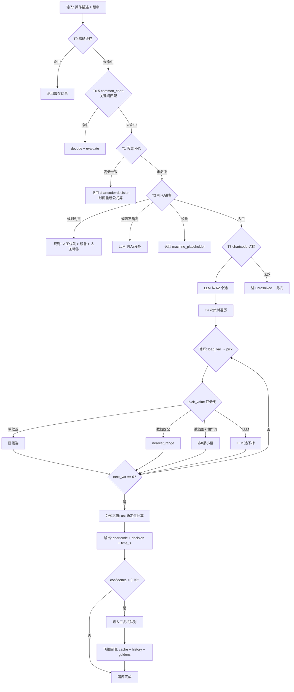

# STDS 全链路决策逻辑

> 从"一个问题"到"输出结果"的完整流程。
> 基于当前代码实现(2026-07-17)。

---

## 一句话总结

```
输入操作描述 → 5 级快速路径(缓存/关键词/历史/规则/召回) → 决策树遍历 → 公式求值 → 输出结果
```

---

## 完整流程

### 输入

```python
StdsElement(
    number: int,           # 序号
    operation_des: str,    # 操作描述(如"操作人员移动吊具")
    line_name: str,        # 项目名称(如"BEV3 RESS P1")
    station_op: str,       # 工位(如"OP010")
    freq: float = 1.0,     # 频率(同一操作重复几次)
)
```

### Step 1: T0 精确缓存

```
输入: norm_key = "操作人员移动吊具"
查询: cache.get(norm_key)
├─ 命中 → 直接返回缓存结果(零 LLM,毫秒级)
└─ 未命中 → 继续 T0.5
```

**作用**:相同操作第二次分析时直接命中,零开销。

### Step 2: T0.5 common_chart 关键词匹配

```
输入: "操作人员移动吊具"
查询: 33 条预定义高频动作的关键词(1-8 列)
匹配规则: 关键词长度 >= 3,优先最长关键词
├─ 命中 → decode(决策描述) + evaluate(公式) → 返回
└─ 未命中 → 继续 T1
```

**覆盖的 33 条高频操作**:

| 操作 | 动作代码 | 决策串 | 时间 |
|---|---|---|---|
| 转身90度 | 202 010 | T,90,NB | 0.72s |
| 行走1米 | 050 222 | UOBS,0.8MX | 0.72s |
| 扫码 | 060 010 | LS | 1.2s |
| ... | ... | ... | ... |

### Step 3: T1 历史 kNN 检索

```
输入: "操作人员移动吊具"
查询: history_index.knn(text, k=5)
条件: hits[0].score >= 0.92 且 top-3 邻居一致
├─ 命中 → 复用邻居的 chartcode + decision,时间重新公式算 → 返回
└─ 未命中 → 继续 T2
```

**数据源**:已人工编辑的记录 + common_chart seed + 复核回灌。

**关键**:只复用 chartcode + decision,时间**重新用公式算**(不读历史时间)。

### Step 4: T2 判人/设备

```
输入: "操作人员移动吊具"
判断: 动作的执行者是谁?
```

**三级规则(优先级递减)**:

```
1. 人工优先关键词: "操作人员"、"人工"、"工人" → 直接判人工
2. 设备关键词: "自动"、"AGV自动"、"机器人自动" → 直接判设备
3. 人工动作关键词: "拿取"、"转身"、"移动"、"搬运" → 判人工
4. 以上都不命中 → LLM 兜底(classify_machine)
```

```
├─ 判断为设备 → 返回 machine_placeholder(时间=0,不走决策树)
└─ 判断为人工 → 继续 T3
```

### Step 5: T3 chartcode 选择

```
输入: "操作人员移动吊具" + 62 个 chartcode 标题
调用: LLM(mimo-v2.5-pro) 从 62 个里选最匹配的
输出: "061 22A"
```

**62 个 chartcode**(部分):

| chartcode | 标题 | 典型用途 |
|---|---|---|
| 050 221 | Get Object | 拿取物体 |
| 050 222 | Walk | 行走 |
| 061 22A | Horiz. & Vert. Travel: Articulating Arm, Hoist, Balancer | 移动吊具 |
| 180 061 | Visual Inspection | 目视检查 |
| ... | ... | ... |

```
├─ LLM 返回有效 chartcode → 继续 T4
└─ LLM 返回无效/失败 → 进 unresolved + needs_review
```

### Step 6: T4 决策树遍历

```
输入: chartcode="061 22A" + 操作描述="操作人员移动吊具"
```

**决策树结构**:

```
061 22A (Horiz. & Vert. Travel)
├─ V1: 运输方式(4 个候选)
│   ├─ [0] Empty Return
│   ├─ [1] Empty Hoist/Balancer
│   ├─ [2] Loaded Arm
│   └─ [3] Loaded Hoist/Balancer  ← LLM 选这个
│       → next_var=2, next_range=1
├─ V2: 水平距离(26 个候选)
│   ├─ [0] 0 ft / 0 m
│   ├─ [1] 2 ft / 0.6 m  ← 非0最小值(数值型+动作词)
│   ├─ [2] 4 ft / 1.2 m
│   └─ ...
│       → next_var=3, next_range=1
├─ V3: 垂直距离(数值型)
│   ├─ [0] 0 in / 0 cm
│   ├─ [1] 12 in / 30 cm  ← 非0最小值
│   └─ ...
│       → next_var=0 (终止)
```

**遍历过程**:

```python
var, range = 1, 1
while var != 0:
    candidates = chart.candidates(var, range)  # 双键收窄
    choice = pick_value(op_des, candidates)     # 四分支选值
    values[var] = choice.formula_value
    abbrevs.append(choice.metric_abbrev)
    var, range = choice.next_variable, choice.next_range
```

### Step 7: pick_value 四分支选值

每个变量的选值逻辑:

```
输入: 操作描述 + 候选列表
├─ 分支1: 单候选 → 直接选(100% 确定)
├─ 分支2: 操作描述有明确数值(如"7m") → nearest_range(95% 确定)
├─ 分支3: 候选是数值型 + 操作描述含动作词 → 非0最小值(80% 确定)
└─ 分支4: LLM 选(分类型变量) → 结构化输出下标(70% 确定)
```

**分支3 的判断逻辑**:

```python
def _is_numeric_candidates(cands):
    # 超过一半候选含 inches/lbs/cm/kg 等单位
    numeric_count = sum(1 for c in cands if any(u in c.description for u in ["inches","lbs","cm"]))
    return numeric_count >= len(cands) * 0.5

def _pick_non_zero_min(cands):
    # 选 formula_value > 0 的最小值(执行动作时的最小合理值)
    non_zero = [c for c in cands if c.formula_value > 0]
    return min(non_zero, key=lambda c: c.formula_value)
```

**分支4 的 LLM prompt**(含 default bias):

```
规则:
1. 如果操作描述明确提到了某个特征,选最匹配的选项
2. 数值型变量:含动作词 → 选非 0 最小值;无动作词 → 选 0
3. 分类型变量:选"No"、"无"、"Simple"等默认选项
4. 不要无脑选第 0 项,要根据操作语义判断
```

### Step 8: 公式求值

```
输入: chart.formula = "(V1*0.008936+V2*0.00023323*V5+V3*0.0003675+V4*0.0002866*V5)*V6*60"
      values = {1: 3.0, 2: 0.6, 3: 12.0, ...}
计算: ast 确定性求值(不是 LLM 口算!)
输出: time_single = 2.19s
```

**关键**:公式用 Python `ast` 模块解析,只允许算术运算,不允许任意代码执行。

### Step 9: 输出结果

```python
StdsResult(
    element=el,
    chartcode="061 22A",
    decision="LHB,0.6HTX,30VTX,",  # 各变量的 metric_abbrev 拼接
    time_s=2.19,                     # 公式求值 × 频率
    cv="V",                          # 增值/非增值
    freq=1.0,
    source=Source.FORMULA,           # 来源
    confidence=0.9,                  # 置信度
    needs_review=False,              # 是否需要人工复核
    trace=[                          # 每步选择的审计留痕
        ("V1", "Loaded Hoist/Balancer", "操作描述为'移动吊具',涉及吊具的移动"),
        ("V2", "2 ft / 0.6 m", "操作描述包含'移动'动作,非0最小值"),
        ("V3", "12 in / 30 cm", "numeric-non-zero-min(fv=12.0)"),
    ],
)
```

### Step 10: 置信度判断 + 人工复核

```
confidence = min(各步置信度)
├─ confidence >= 0.75 → needs_review=False → 直接落库
└─ confidence < 0.75  → needs_review=True  → 进复核队列
```

**复核流程**:

```
人工查看 trace(每步选了什么、为什么)
├─ 确认正确 → 飞轮回灌(cache + history_index + goldens)
└─ 修改结果 → apply_edits → 飞轮回灌
```

---

## 决策流程图(Mermaid)



---

## 快速路径命中率(预期)

| 路径 | 条件 | 命中率 | LLM 调用 |
|---|---|---|---|
| T0 缓存 | 相同操作第二次 | ~30% | 0 次 |
| T0.5 common_chart | 33 条高频 | ~15% | 0 次 |
| T1 kNN | 历史相似操作 | ~10% | 0 次 |
| T2 规则 | 关键词命中 | ~80% | 0 次 |
| T3+T4 全链路 | 以上都不命中 | ~20% | 2-4 次 |

**暖机后**:随着复核回灌,T0/T1 命中率持续上升,LLM 调用持续下降。

---

## 关键设计决策

| 决策 | 选择 | 理由 |
|---|---|---|
| 公式计算 | ast 确定性求值 | Dify 用 LLM 口算,31% 偏差>10% |
| 变量选值 | LLM 只返回下标 | 数值/跳转指针全来自 DB,幻觉无法污染 |
| 默认值 | 数值型选非0最小,分类型选默认 | Dify 选"非0记录",对齐 |
| 判人/设备 | 规则优先+LLM 兜底 | 80% 规则命中,省 LLM 调用 |
| chartcode | LLM 从 62 个选 | 暂不接向量,后续可加 RAG |
| 并发 | asyncio + Semaphore | 可配置,防 API 限流 |
| 复核 | interrupt/resume 状态机 | 低置信暂停,人工确认后继续 |
| 飞轮 | 复核回灌 cache+history | 越用越准越便宜 |

---

## 日志查看

```bash
# 实时查看全链路日志
tail -f ~/Desktop/stds_project/stds_debug.log

# 关键标签
# [T0]      缓存命中/未命中
# [T0.5]    common_chart 关键词匹配
# [T1]      kNN 历史检索
# [T2]      判人/设备(规则 or LLM)
# [T3]      chartcode 选择(LLM)
# [T4]      决策树遍历
# [pick]    变量选值(四分支)
# [LLM]     LLM 调用(prompt + response)
```

---

## 与 Dify 的对比

| 环节 | Dify | 新系统 |
|---|---|---|
| 判人/设备 | 1 个 LLM | 规则+LLM 兜底 |
| chartcode 选择 | 知识库 RAG + 2 个 LLM | 1 个 LLM |
| 变量选值 | 12 个 LLM(各输出 4 字段) | 1 个函数循环(只输出下标) |
| 公式计算 | LLM 口算(31% 偏差>10%) | ast 确定性求值(0 偏差) |
| 每记录 LLM 调用 | 15+ 次 | 0-4 次 |
| 单条延迟 | ~95s | ~2-5s |
