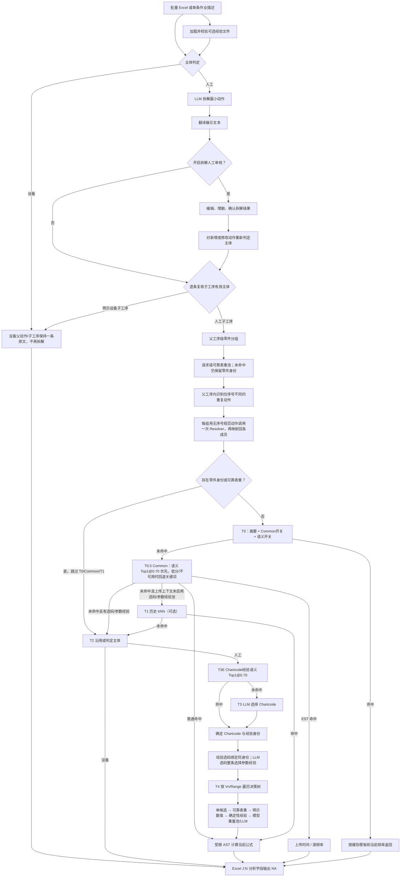

# STDS 全链路决策逻辑

> 当前技术流程说明，基于 2026-08-05 的代码实现。
> 项目入口、输入格式和启动方式同时参见 [README.md](README.md)。

## 一句话总结

```text
输入作业描述
→ 判定人工/设备
→ 人工动作拆解与翻译
→ 逐条复核拆解子工序的有效主体
→ 父工序级零件分组，可靠表重匹配（未命中时保留零件身份）
→ 父工序内重复动作归一并共享一次决策
→ scoped T0 或上传 Common Chart 语义 Top1/关键词回退快速决策（无零件身份且无可靠重量时）
→ 未命中时由 Chartcode 经验语义 Top1 或 LLM 选码
→ 按选码来源严格绑定或一次选择整条参数经验，再贯穿全部 Vn
→ 表重未命中时，请求级模型重量池使相同零件的公斤档判断在同父工序和跨父工序中一致
→ 普通图表按数据库公式计算，EST 使用上传固定时间
→ 输出结果、选择原因和 Trace
```

## 一、核心原则

当前实现遵循以下原则：

1. Chartcode、参数候选、公式值和跳转指针必须来自当前数据库；
2. LLM 用于语义理解、拆解、零件提取和候选选择，不负责口算公式；
3. 零件重量使用单重，不从描述中提取数量参与乘法；
4. 同一父工序拆出的同一零件操作链共享完全相同的零件身份和可靠重量上下文；
5. 同一父工序内仅序号不同的重复动作共享 Chartcode、参数和单次工时；
6. 重复动作的条数不写入 `freq`，每条记录仍按一次动作独立输出；
7. 参数经验按动作身份隔离，不能仅按 Chartcode 横向复用；
8. 操作描述中的明确事实优先于经验默认值；
9. 匹配不唯一、置信不足或数据冲突时回退，不静默套用结果；
10. 明确设备动作在任何缓存、经验、重量或公式路径之前短路返回；
11. Common 只来自当前上传经验文件，不从数据库自动加载；
12. 同一批任务内，相同归一化零件的模型重量判断在同父工序子步骤和跨父工序间全局一致；
13. 动作缓存以完整工作簿摘要、Common 开关和经验语义开关隔离；存在零件身份时不读写动作缓存；
14. 重量只用于选择当前重量档，不乘零件数量，不改写 `freq`；
15. 每个关键选择都写入 Trace，便于审计和人工复核。

## 二、输入与运行上下文

### 2.1 批量输入

批量入口读取 Excel 工作表 `数据表` 的 A:G：

| 列 | 字段 |
|---|---|
| A | 序号 |
| B | 项目名称 |
| C | 产品型号 |
| D | 产线 |
| E | 工位号 |
| F | 工位描述 |
| G | 作业描述 |

系统保留拆解原文用于工时分析，并生成“翻译后作业描述”用于展示和最终输出。

### 2.2 单条输入

单条分析接受：

```python
operation_des  # 原始作业描述
line_name      # 项目名称
station_op     # 工位
freq           # 用户显式填写的频率
```

单条输入同样先经过主体判定、拆解、翻译、父工序重量分组和重复动作一致性处理，
再逐条返回子工序结果。

### 2.3 零件重量上下文

零件重量表由 `PART_WEIGHT_XLSX_PATH` 指定，加载后形成进程内
`PartWeightIndex`。它不是随每次主输入上传的文件。

每次批量分析、单条分析或 API Job 对应一个 `Deps`，其中包含两个请求级池：

- `PartWeightPool`：对重量表的可靠命中或正常未命中执行 single-flight 并复用结果；
- `ModelWeightPool`：重量表未命中但已识别零件身份时，在公斤候选节点复用模型第一次选中的物理重量档。

两个池都只在该 `Deps` 内共享；新的上传任务或 API Job 创建新池，不会沿用上一个任务的重量判断。

### 2.4 STDS 经验上下文

Streamlit 页面允许随主输入上传一份可选经验 Excel。文件通过校验后形成请求级
`ExperienceIndex` 和 `CommonChartEntry` 集合，并使用整个文件的 SHA-256 摘要标识版本。
API 可通过 `POST /experience-contexts` 上传同一文件，再在 `POST /jobs` 中用
`experience_context_id` 引用该不可变上下文。

`chartcode选择经验`、`参数选择经验` 与 `Common_Chart` 是三个独立能力。Common
只使用当前上传工作簿中的 `Common_Chart`，数据库旧 `common_chart` 表不再自动加载。

UI 与 API 的 `use_semantic_experience` 默认开启。它控制 Chartcode 经验语义选码和
Common 语义 Top1 优先匹配；关闭后 Common 直接执行确定性关键词匹配。

### 2.5 STDS 计算图表

当前 `MostChart` 从 SQLite 数据库 `formula` 表加载，内存结构为：

```python
MostChart(
    chartcode: str,
    title: str,
    formula: str,
    value_added: bool,
    developed_in_seconds: bool,
    options: {
        (VariableNumber, RangeNumber): [ValueOption, ...]
    },
)
```

`ValueOption` 中保存：

```python
variable_number
range_number
value_number
description
metric_abbrev
formula_value
next_variable
next_range
```

只有存在于当前 `formula` 图表库中的 Chartcode，才能进入普通决策树计算。
`EST C00` / `EST V00` 在数据库中保留标准 `V1R1 → 5S → V0R0` 单节点定义以兼容
现有遍历器；当它们来自上传 `Common_Chart` 时，按固定时间类型直接求值。

## 三、总流程图



## 四、阶段 A：主体判定、拆解和翻译

### A1. 主体判定

系统先调用关键词规则：

```text
明确人工主体（含 Manual）优先
→ 否则“自动”/Auto 或句首设备主体（可带数量和量词）
→ 其他设备关键词
→ 人工动作关键词
→ 无法确定时调用 LLM
```

输出只有两类：

- `人工`
- `设备`

句首明确人工主体的优先级最高，即使句中同时出现机器人、AGV 或自动设备，也按人工动作
继续判断。没有句首明确人工主体时，出现“自动”/`Auto`，或句首出现“机器人”“机械手”
“AGV”“设备”（前面可带数字/中文数词及“个、台、套、组、辆、部、只”等量词），
就是明确设备自主动作。

```text
2个机器人拧紧65颗上盖螺栓，6±1Nm
→ 句首为带数量和量词的机器人主体
→ 设备
```

### A2. 设备动作

设备动作：

- 设备父动作保持一条原始动作，不进入人工动作拆解；
- 主体数、零件数或加工数量不展开，也不参与数量乘法；
- 不进入零件重量提取、重复人工动作一致性、经验、人工 STDS 决策树、公式、
  T0 缓存、T0.5 Common Chart 或 T1 历史 kNN；
- 内部返回 machine placeholder；
- 最终 Excel 的 J:N，即 Decisions、Chart、C/V、Freq、Time 字段统一输出 `NA`。

因此上例仍只保留一条
`2个机器人拧紧65颗上盖螺栓，6±1Nm`，不会生成 65 条人工拧紧动作，也不会计算
`单次工时 × 65`。

### A3. 人工动作拆解

人工动作调用 LLM 拆成最小可分析子工序。

```text
输入：人工A用吊具将Tray落位到toptooling小车

可能拆为：
1. 人工A拿取吊具
2. 人工A移动吊具
3. 人工A用吊具夹持Tray
4. 人工A移动吊具
5. 人工A操作吊具落位Tray到toptooling小车上
6. 人工A操作吊具释放Tray
```

拆解失败或返回空结果时：

- 回退为原始动作；
- 标记拆解阶段需要人工复核；
- 保存异常信息。

### A4. 批量复用

批量输入中，归一化后相同的父作业描述只拆解一次，再把拆解结果复用到相同行。

### A5. 翻译

系统对唯一的拆解动作生成翻译文本：

- 拆解原文是工时分析的真实输入；
- 翻译文本只用于展示和输出；
- 同一拆解原文只翻译一次。

### A6. 可选人工审核

开启“人工审核拆解”后，流程在拆解和翻译结束时暂停。

用户可以：

- 修改动作；
- 新增动作；
- 删除动作；
- 下载拆解文件；
- 上传修改后的拆解文件；
- 确认后继续。

人工审核后新增或修改的动作会重新进行主体判定，但不会再次自动拆解。

无论是否审核，人工父动作的每条拆解子工序还会计算“有效主体”：

```text
子工序自身是明确设备动作 → 有效主体=设备
否则 → 继承父工序主体
```

这一步允许 `设备自动拧紧上盖螺栓` 等子工序覆盖已继承的人工父主体。设备子工序
不会被重新拆解，并在后续各阶段都按设备隔离处理。

## 五、阶段 B：父工序级零件重量处理

### B1. 为什么在父工序级处理

如果逐条对子工序提取零件：

```text
夹持Tray → 可以提取 Tray
移动吊具 → 只能看到吊具，无法知道正在承载 Tray
落位Tray → 可以提取 Tray
```

这会造成同一物理零件链中的子工序使用不同重量。

当前实现把父工序和全部人工子工序一次性交给 LLM，识别“同一个物理零件”的连续操作链；
明示设备子工序会在调用前剔除。

### B2. LLM 零件分组

LLM 返回：

```python
PartOperationGroup(
    part_name="Tray",
    child_indexes=[3, 4, 5, 6],
    reason="同一吊运链",
)
```

约束：

1. `part_name` 必须是父工序或子工序原文中的连续文字；
2. 不得翻译、补充或猜测零件号；
3. 工具准备动作不继承尚未夹持的零件重量；
4. 承接同一负载的工具动作可以加入该零件组；
5. 一个父工序包含多个零件时分别建组；
6. 同一个 `child_index` 不能可靠属于多个组；
7. 明示设备子工序在调用 LLM 前已从子工序列表中剔除，不提取零件、不接收重量上下文；
8. 无法确认的子工序不分组。

通过上述验证的 `part_name` 会先形成 `PartIdentityContext`。重量表未命中只表示
“没有可靠数值”，不会删除这个已验证的零件身份。

### B3. 歧义处理

若一个子工序被分给多个零件：

- 删除该子工序的自动重量上下文；
- 同时删除用于模型重量池的零件身份；
- 不选择任意一个零件；
- 后续参数选择回退普通逻辑。

### B4. 重量表严格去重

重量表只有以下四项全部完全一致才视为重复：

```text
Part No.
+ English Description
+ Chinese Description
+ 零件单重(KG)
```

完全重复的记录保留第一条逻辑记录，并合并所有来源单元格。

以下情况都不去重：

- 零件号不同；
- 英文名称不同；
- 中文名称不同；
- 重量不同。

### B5. 名称匹配

匹配顺序：

```text
归一化完全匹配
→ 语义向量相似度匹配
→ 无可靠表重结果（保留零件身份）
```

归一化只用于匹配，不用于严格去重。

语义匹配默认要求：

- 相似度不低于 `0.85`；
- 第一名相对下一不同记录至少领先 `0.05`；
- 长度不超过 4 的英文缩写只允许精确匹配；
- 同一个名称对应多个不同正重量时视为冲突，不返回重量。

向量在首次需要语义匹配时按需构建并缓存在进程内存，不依赖独立向量数据库。

### B6. 单重规则

描述中的数量被忽略：

```text
“拿取3个螺丝” → part_name = “螺丝” → 使用螺丝单重
```

不执行：

```text
单重 × quantity
```

原因是前置拆解会把重复执行拆为独立动作，批量分析中的每条拆解子工序按一次处理。

单条页面中用户显式填写的 `freq` 仍参与最终工时计算。`freq` 是调用参数，
不是从零件数量推断出的数量。

### B7. 共享零件身份与可靠重量上下文

一个可靠重量命中转换为：

```python
NumericContext(
    weight_kg=...,
    query_name=...,
    matched_name=...,
    similarity=...,
    match_type=...,
    source=...,
    group_id=...,
)
```

同一零件组中的全部子工序复用同一个 `NumericContext` 对象，所以零件名、
匹配记录、单重和来源保持一致。

无论表重是否命中，同一零件组中的全部子工序都复用同一个
`PartIdentityContext`。它的主要字段是：

```python
PartIdentityContext(
    part_name=...,
    identity_key="extracted_name:{归一化零件名}",
    source=...,
    group_id=...,
)
```

批量分析的结果复用键还包含：

```text
主体
+ 子工序文本
+ 父重量解析作用域
+ 当前 NumericContext
+ 当前 PartIdentityContext
```

因此，相同子工序文本出现在不同父工序或不同零件组中时，不会错误复用另一组的重量结果。

### B8. 模型重量池的全局一致性

当可靠表重未命中，但 `PartIdentityContext` 存在时，系统不会让每个子工序独立猜测重量。
`Deps.model_weight_pool` 以保守归一化零件身份为 key，保存第一次模型选中的物理重量档：

```text
同一零件第一个公斤候选节点
→ 单次 LLM 判断
→ 缓存选中的物理 kg 档
→ 同父工序其他子步骤复用
→ 同一 Deps 内的其他父工序也复用
```

具体约束：

- 只有当前节点全部候选都能解析为正数公斤档时才使用；
- 只包裹最终 LLM 回退，不覆盖单候选、可靠表重、操作原文明示数值或确定性参数经验；
- 同一零件使用逐 key 异步锁执行 single-flight，并发请求不会同时产生多个首次判断；
- 身份归一化统一 NFKC、大小写和空白，但保留连字符、斜杠等身份标点，避免把
  `P-1`/`P1` 或 `A/B`/`AB` 合并；表重命中后优先使用 canonical 零件号；
- 缓存物理重量档而非候选对象或下标。跨 Chartcode 依次按相同 kg、相同 lb、
  小幅 kg 换算差异和不低于缓存重量的最小档映射；
- 缓存重量高于当前 Chartcode 最大档时临时选择最大档，同时降低置信度并强制人工复核；
- 模型调用失败或取消不写缓存，后续调用可以重试；
- 池的作用域是一次批量/单条任务或 API Job，不同上传任务之间完全隔离；
- 零件数量不参与缓存 key 或重量乘算，也不改写记录 `freq`。

### B9. 重复动作一致性

系统在每个父工序内部，将只因序号或计数词不同而产生的子工序归为一致性组：

```text
人工A拧紧冷板第一个螺栓
人工A拧紧冷板第二个螺栓
人工A拧紧冷板第三个螺栓
人工A拧紧冷板第四个螺栓
```

规范动作是：

```text
人工A拧紧冷板螺栓
```

系统用规范动作调用一次 Resolver，再把相同的 Chartcode、Decisions 和单次工时
复制回全部原始子工序。输出描述仍保留“第一、第二、第三、第四”等原文。

分组键保留动作词、工具和工程数值，并叠加当前重量/数值上下文。因此：

- “对准螺栓”与“拧紧螺栓”分属不同组；
- “手工拧紧”与“用拧紧枪拧紧”分属不同组；
- `5 Nm` 与 `8 Nm` 不会合并；
- 不同 `NumericContext` 或 `PartIdentityContext` 不会共用分析结果；
- 明示设备子工序不进入一致性组，保持原始单条动作；
- 组只在当前父工序内有效，不跨无关父工序传播。

一致性组不代表频率。若四条记录的 `freq` 都是 `1`，每条记录都保存同一个单次工时，
不会产生某一条 `×4` 的结果；父工序总工时才会通过四条记录求和自然得到四次动作工时。

## 六、阶段 C：经验文件加载与动作身份

### C1. 工作表结构

经验文件包含：

`chartcode选择经验`

| 字段 | 用途 |
|---|---|
| 操作内容 | 动作身份 |
| 动作代码或参数选择 | Chartcode |
| 经验ID | 可选的稳定身份 |

`参数选择经验`

| 字段 | 用途 |
|---|---|
| 操作内容 | 动作身份 |
| 动作代码 | Chartcode |
| 参数选择经验 | 按 Vn 编写的自然语言规则 |
| 经验ID | 可选；存在时优先绑定 |

`Common_Chart`

| 字段 | 用途 |
|---|---|
| 操作内容 | Common 动作名称与审计标签 |
| 决策描述 | 普通 Chartcode 决策串；EST 行按固定时间处理 |
| 动作代码 | 当前 Chartcode |
| 增值/非增值(C/V) | 必须与 Chartcode 属性一致 |
| 频率 | 必须为 `1` |
| 时间 | 普通行用于公式结果校验；EST 行是固定时间来源 |
| 关键词描述1～8 | T0.5 的确定性匹配关键词 |

### C2. Chartcode 经验加载

每一行先执行：

1. 归一化操作内容；
2. 归一化 Chartcode；
3. 检查 Chartcode 是否存在于当前计算图表库；
4. 生成或读取经验 ID；
5. 排除冲突和完全重复身份。

没有显式经验 ID 时，系统生成：

```text
auto:{归一化操作内容}|{归一化Chartcode}
```

### C3. 全局参数经验池

`参数选择经验` 独立形成参数索引，不要求同一动作先存在或命中
`chartcode选择经验`。每一条有效参数经验的身份至少包含：

```text
经验ID + 归一化操作内容 + Chartcode
```

`经验ID` 用于稳定标识和冲突检查。参数池在选码后按两种方式使用：

- Chartcode 来自经验语义 Top1：只能读取与该选码行完全相同经验身份的参数规则；
- Chartcode 来自 LLM：收集该 Chartcode 下所有有效参数经验，随后一次选择一整条。

参数文本会拆成：

```python
variable_hints = {
    1: "参数V1的经验",
    2: "参数V2的经验",
    3: "参数V3的经验",
}
```

### C4. Common_Chart 加载与验证

Common 行按两种类型加载。

普通公式行：

1. Chartcode 必须存在于当前计算图表库，C/V 必须一致；
2. 频率必须是 `1`，时间必须是有限非负数；
3. 决策串先规范化旧缩写，再进行严格解码；
4. 解码器在全部候选中先寻找精确 token，完全没有精确候选时才允许数值近似；
5. 任何低置信、歧义或不完整解码都会禁用该行；
6. 单次时间用当前数据库公式重新计算，上传时间只作审计；二者不一致时告警，
   运行时以公式值为准。

固定时间行：

```text
Chartcode = EST C00 或 EST V00
→ kind = fixed_time
→ time_single = 上传时间 / 源频率
```

当前源频率强制为 `1`，固定时间必须大于 `0`。运行时不遍历普通公式，也不再次乘源频率。

关键词规则：纯中文至少 2 字，其他关键词至少 3 个归一化字符。同一行的重复关键词去重；
同一个关键词指向不同输出会在上传阶段告警，并在运行时按歧义回退。

没有有效关键词不会删除一条其他字段均有效的 Common 行。只要“操作内容”非空，该行仍被
保留，并以“操作内容 + 有效关键词”构造语义文档；关键词为空时就只使用操作内容。

### C5. 校验级别

错误会暂停分析：

- 无法读取工作簿；
- 缺少 `chartcode选择经验`；
- 缺少关键表头；
- 校验后没有任何可用经验能力。

警告只影响对应行或变量：

- Chartcode 不在当前图表库；
- 操作内容为空；
- 经验 ID 冲突；
- 参数经验无法唯一绑定；
- 同一动作身份存在冲突参数经验；
- 参数单位或默认值不在当前 Vn 候选中；
- 单条 Common 的 Chartcode、C/V、频率、时间、决策串或关键词不合法；
- 普通 Common 上传时间与公式重算时间不一致；
- Common 关键词对应多个不同输出。

参数值不合法时只删除对应 Vn 提示，不删除该动作的其他有效经验。
`Common_Chart` 缺失或结构错误只禁用 Common 能力；当 Common 开关关闭时，不连带阻断
同一文件中仍有效的选码和参数经验。

### C6. 有效经验计数

UI 分开显示：

```text
有效 Chartcode 选择经验
有效参数选择经验
有效 Common_Chart
其中 EST fixed_time
```

每一项都是通过相应校验后的有效记录数，不等于原工作表行数。

当前 `STDS评估经验V1.2.xlsx` 的校验摘要是：41 条 Chartcode 选择经验、39 条参数经验、
25 条 Common（21 条公式行、4 条 EST 固定时间行）；另有 5 条上传时间与公式重算值差异
告警，不影响这些普通 Common 行生效。

### C7. Chartcode 经验只走语义 Top1

生产选码路径调用专用 `match_chartcode_semantic()`，绝不使用操作内容的精确或包含匹配
直接决定 Chartcode。规则固定为：

```text
全部有效 Chartcode 经验计算余弦相似度
→ 取 Top1
→ score >= 0.70 则接受
→ 否则回退普通 Chartcode LLM
```

该路径不要求 Top1 与 Top2 之间存在 margin；同分时按 `chart_row`（Excel 行号）升序，
再按经验 ID 稳定选择。`use_semantic_experience=false`、向量构建不可用或查询失败时，均
视为未命中并回退 LLM。

### C8. Common 语义 Top1 优先、关键词回退

Common 默认先执行语义 Top1：

```text
扫描全部有效 Common 语义文档
→ 取 Top1，score >= 0.70 时直接接受
→ 低分、语义关闭或向量不可用时，扫描归一化精确关键词
→ 若全局没有精确项，再做单向 keyword in input，并选择最长关键词
```

语义 Top1 不要求 margin，同分按 Common Excel 行号稳定选择。达标的语义结果优先于
关键词结果，也可以覆盖关键词歧义。进入关键词回退后，禁止用 `input in keyword` 反向召回：

- 相同最高优先级指向等价输出：固定选择 Excel 行号最小、关键词位置最靠前的一项；
- 相同最高优先级指向不同输出：返回歧义并进入后续 Resolver。

语义未命中且关键词也无候选时，继续后续 Resolver 链路。

### C9. 为什么不能只按 Chartcode 取参数

`202 010` 可以同时表示转身和弯腰相关动作：

```text
转身 → V1=Turn，V2=转身角度，V3=No Bend
弯腰 → V1=No Twist or Turn，V3=弯腰角度
```

如果只按 `202 010` 查参数，转身可能读取弯腰默认值。

当前流程始终传递完整参数上下文：

```python
ExperienceContext(
    experience_id=...,
    operation_label=...,
    chartcode=...,
    match_type=...,
    chart_row=...,
    parameter_row=...,
    variable_hints=...,
)
```

遍历到 Vn 时只读取：

```text
当前 ExperienceContext.variable_hints[当前 Vn]
```

参数规则按选码来源执行：

1. Chartcode 由经验语义 Top1 选出时，使用该选码行的经验 ID、归一化操作内容和 Chartcode
   严格查找同身份参数。不得切换到同码的另一动作；同身份已有参数提示则直接沿用，唯一
   绑定行可用，多条绑定冲突则全部忽略；
2. Chartcode 由 LLM 选出时，取该码下全部有效参数经验。零条则不用经验，一条直接用，
   多条一次性交给 LLM 选择一整条；返回非法索引或调用失败时不用经验，不猜第一条；
3. 最终最多保留一个 `ExperienceContext`，贯穿整个 T4。每个 Vn 只能读取这一个上下文中
   对应变量的提示，禁止 V1 用“转身”、V3 又切到“弯腰”。

### C10. 向量生命周期与降级

Chartcode 经验和 Common 各自使用当前上传上下文内的内存索引。文档向量在第一次真正
需要语义匹配时才构建；同一索引的并发首次查询通过异步锁合并，不需要持久化向量数据库。

以下情况都不允许产生语义命中：

- 使用 `MockEmbed`；
- 远端 embedding 请求失败并降级为 Mock 占位向量；
- 返回向量数量、维度或有限性校验失败；
- 查询向量调用失败。

此时 Chartcode 经验回退选码 LLM；Common 回退关键词匹配，若关键词也未命中则继续后续
Resolver 链路。降级不会用伪向量猜测经验。

## 七、阶段 D：Resolver 级联

### D0. 明示设备预检

Resolver 的第一步发生在决策作用域、T0 缓存和所有人工路径之前：

```text
machine_hint=True
或原始描述命中明确设备规则
→ 立即返回 machine placeholder
```

这是一层兜底保护。即使拆解或审核阶段遗留了错误的人工 hint，或者缓存中已有同文本的
人工计算结果，明确设备动作也不能泄漏到零件重量、重复动作、经验、公式、缓存或历史路径。

### D1. 决策作用域判断

设备预检通过后，Resolver 在任何完整动作复用前先解析零件身份与可靠表重，再分别判断：

```python
part_scoped = numeric_context is not None or part_identity_context is not None
experience_scoped = experience_index.available
cache_scope = 完整工作簿摘要 + Common开关 + 经验语义开关
```

这三个作用域不再合并成一个总开关：

- `part_scoped=True`：只要存在可靠表重或已验证零件身份，就跳过 T0、Common 和 T1，并且本次结果不写入完整动作缓存；
- 有上传经验：仍可读取同一摘要 scope 下的 T0，也可使用该文件中的 Common；
- `experience_scoped=True`：只禁用可能绕过选码/参数经验的 T1；
- Common 与经验语义开关状态都进入缓存 scope，任一开关切换后不能命中另一模式留下的结果。

在 Streamlit 的正常人工分析流程中，父工序重量分组会先于子工序 Resolver 执行。
表重命中会同时传入 `NumericContext` 和 `PartIdentityContext`；表重未命中但零件识别有效时，
只传入 `PartIdentityContext`，仍属于 `part_scoped`。这一约束防止动作级 T0/Common/T1
在到达模型重量池之前提前返回旧决策。

### T0. 精确缓存

仅在没有零件身份且没有可靠重量上下文时使用。

缓存键由归一化操作文本和以下 scope 组成：

```text
当前完整上传工作簿 SHA-256 摘要
+ Common 开关（0/1）
+ 经验语义开关（0/1）
```

无上传且 Common 关闭时保留兼容的旧全局 key。缓存内容保存 `freq=1` 的单位时间模板：

```text
命中 → 单位时间 × 当前输入 freq → 返回
未命中 → T0.5
```

这样相同操作以不同频率分析时不会复用已经乘过频率的总时间。
存在可靠重量或仅存在零件身份时，都既不读缓存，也不写缓存，防止其他动作上下文复用重量驱动的参数结果。

### T0.5. Common Chart

该路径使用当前上传经验文件解析出的 `Common_Chart`；不会调用数据库
`load_common_chart()`，也不会在缺少上传上下文时静默回退旧表。

启用且没有零件身份、也没有可靠重量上下文时：

1. 语义开关开启且向量可用时，先执行 Common 语义 Top1，阈值 `0.70`、无 margin、
   同分按 Excel 行号稳定选择；达标时直接采用；
2. 语义低分、关闭或向量不可用时，回退全候选精确关键词；无精确项时执行单向最长包含；
3. 回退关键词候选若因不同输出产生歧义，停止 Common 并进入后续 Resolver；
4. 普通行严格解码决策串，并用当前数据库公式重算时间；
5. `EST C00` / `EST V00` 行直接使用已校验的上传单次时间；
6. 命中结果以 `freq=1` 模板写入当前 scope，输出时只乘输入记录 `freq` 一次。

没有关键词但“操作内容”有效的 Common 行仍参与语义层；语义未命中时没有关键词可供回退。

UI 当前默认开启 Common。若开关开启但没有上传含有效 `Common_Chart` 的文件，批量和单条
分析会暂停并提示上传或关闭开关。API 同样以 422 拒绝缺少有效 Common 上下文的 Job。

### T1. 历史 kNN

T1 是可选能力，只有注入 `history_index`、没有零件身份与可靠重量、并且当前上传上下文没有有效
Chartcode/参数经验时运行。Common 是否命中在 T1 之前决定。

当前判定条件：

```text
top1 score >= 0.92
且 top3 Chartcode 一致
且 Chartcode 存在于当前图表库
```

命中后只复用：

- Chartcode；
- 决策串。

历史时间不会直接复用，而是用当前数据库公式重新计算。

当前 Streamlit 主流程没有注入历史索引，因此 T1 在该入口通常不执行。

### T2. 人工/设备

两阶段管线已经判定主体时，Resolver 沿用 `machine_hint`，避免再次分类造成同一批次结果不一致。
但明示设备原文的 D0 预检优先级更高，能覆盖错误的 `machine_hint=False`。

如果直接调用 Resolver 且没有 hint：

```text
规则判定 → LLM 兜底
```

设备动作立即返回 machine placeholder。

### T3E. Chartcode 经验语义 Top1

语义开关开启时，人工动作调用专用 `ExperienceIndex.match_chartcode_semantic()`：

```text
动作描述 → 全部有效选码经验向量 → Top1
score >= 0.70 → 接受 Chartcode 与该行经验身份
score < 0.70 / 向量不可用 → T3 LLM
```

不使用精确或包含分支，不要求 margin；同分按 Chart Excel 行号稳定。命中后还必须确认
Chartcode 存在于当前图表库，随后保留完整经验身份，用于严格绑定参数与 Trace。

### T3. LLM 选择 Chartcode

语义经验未命中时，LLM 从当前图表库选择 Chartcode。

最终参数经验选择严格区分选码来源：

- 经验选码：只读取同一 `experience_id + operation + chartcode` 身份绑定的参数，绝不
  换到同码另一动作；
- LLM 选码：获取该码全部有效参数经验；单条直接用，多条一次性交给
  `llm_select_parameter_experience` 选择一整条；失败或非法索引时不用参数经验；
- 选定后只传递这一条 `ExperienceContext` 给 T4，所有 Vn 共享，禁止跨记录混用。

LLM 返回空值、外部代码或数据库中不存在的代码时：

- 结果标记 unresolved；
- `needs_review=True`；
- 不进入决策树。

## 八、阶段 E：决策树遍历与参数选择

### E1. 遍历规则

从：

```text
VariableNumber = 1
RangeNumber = 1
```

开始循环：

```python
while var != 0:
    candidates = chart.options[(var, range)]
    choice = pick_value(...)
    values[var] = choice.formula_value
    abbrevs.append(choice.metric_abbrev)
    var = choice.next_variable
    range = choice.next_range or 1
```

安全检查：

- 重复访问同一 `(var, range)` 判定为环；
- 当前节点没有候选判定为图表错误；
- picker 返回不属于当前候选集合的对象判定为错误；
- 遍历错误输出 unresolved 并进入复核。

### E2. 当前 Vn 的经验读取

每次循环只读取：

```text
experience_context.variable_hints[var]
```

没有当前 Vn 提示时，不把整段经验或其他 Vn 提示传给 picker。

### E3. 参数选择优先级

准确顺序为：

```text
1. 单候选
2. 可靠表重
3. 操作描述中的明示数值（重量节点上即显式重量）
4. 当前动作、当前 Vn 的确定性经验
5. 最终 LLM 回退；若有零件身份且候选全是公斤档，纳入模型重量池
```

#### 1. 单候选

当前节点只有一个候选时直接选择，置信度 `1.0`。

#### 2. 可靠表重

只有当前节点的所有候选都能解析为公斤档时才使用重量。

选择规则：

```text
按公斤档升序排列
→ 选择第一个 >= 零件单重的档位
```

例如：

```text
单重 6.5 kg
候选 5 kg / 7 kg / 10 kg
→ 选择 7 kg
```

以下情况不自动选择：

- 任一候选不是公斤档；
- 单重小于等于 0；
- 单重超过最大候选档；
- 没有可靠表重上下文。

#### 3. 明示数值

系统从描述中提取全部数值事实：

- cm、m、in 距离；
- kg、lbs 重量；
- rpm/转速。

系统逐个事实尝试，只有当前候选确实属于同一个物理维度时才匹配最近档，不能拿距离
数值比较分类变量的 `formula_value`。因此描述同时含“移动 1m、重量 7kg”时，重量节点
仍会读取 7kg，不会因先看到距离而回退模型判断。

#### 4. 当前动作参数经验

经验处理分三种：

1. 经验描述要求读取角度，且操作原文有明确角度：按当前动作规则选择最近角度；
2. 经验中存在唯一、无条件、能唯一映射到候选的默认值：确定性选择；
3. 经验包含条件分支或无法唯一解析：把当前 Vn 经验交给 LLM 辅助判断。

例如：

```text
“默认选择 Unobstructed，除非路径存在障碍时选择 Obstructed”
```

该经验包含两个候选和条件分支，不能无条件套用默认值，必须结合当前操作描述判断。

明确事实优先：

```text
人工A转身90度
```

即使经验默认 180 度，也应选择 90 度。

#### 5. 最终 LLM 回退与模型重量池

没有确定性结果时：

- 将当前候选编号为 `[0]...[n]`；
- LLM 只返回候选下标和理由；
- 下标被限制在合法范围；
- 公式值、缩写和跳转全部取自选中的数据库候选。

如果已有 `PartIdentityContext`，且当前候选全部是可解析的公斤档，上述最终回退还要经过
`ModelWeightPool`：

- 首次选值调用 LLM，并把选中的物理公斤档写入当前请求池；
- 同一零件后续节点不再独立判断，而是把已缓存的物理档映射到当前候选集；
- 跨图表先匹配同公斤档，再用共同磅档吸收 `1 lb = 0.45/0.4357 kg` 一类换算差异；
- 缓存档超过当前图表最大档时不得静默视为正常结果，输出会标记人工复核；
- 该复用穿过父工序边界，但不穿过 `Deps`/批次/Job 边界；
- 非公斤节点、没有零件身份的节点仍是普通 LLM 选值。

## 九、阶段 F：公式计算

普通 Chartcode 的决策树结束后得到：

```python
values = {
    1: V1公式值,
    2: V2公式值,
    ...
}
```

计算过程：

1. 读取当前 Chartcode 的数据库公式；
2. 使用受限 AST 替换并计算 Vn；
3. 禁止执行任意 Python 代码；
4. 得到单次工时 `time_single`；
5. 计算 `time_single × freq`；
6. 最终时间保留两位小数。

历史记录中的时间不会作为普通公式路径的最终计算值。

上传 Common 中的固定时间类型不进入这条普通公式路径：

```text
EST 单次时间 = 上传时间 / Common源频率
最终时间 = EST单次时间 × 当前输入记录freq
```

当前 Common 源频率校验为 `1`。它只用于把上传值规范为单次模板，运行时不再次相乘；
同一父工序拆出的多条记录各自保留自己的单次结果，也不会把成员数写入 `freq`。

## 十、结果、Trace 与人工复核

### 10.1 结果对象

```python
StdsResult(
    chartcode=...,
    decision=...,
    time_s=...,
    cv=...,
    freq=...,
    source=...,
    confidence=...,
    needs_review=...,
    trace=[...],
)
```

### 10.2 Trace

重量命中会写入：

```text
PartWeightLookup
零件查询名 → 匹配名称 / 单重
匹配类型、相似度、来源、父工序组
```

表重未命中但保留零件身份时写入：

```text
PartIdentity
零件名称、归一化身份、来源、父工序组
weight_source=model-global-pool
```

模型重量池在对应 Vn 的选值原因中记录：

```text
model-weight-pool:selected      # 首次模型选择
model-weight-pool:mapped-* / clamped  # 后续节点复用/映射
cached_band_kg、band_kg、part、group_id、source
```

重复动作一致性会写入：

```text
RepeatedActionConsistency
一致性组 ID → 无序号规范动作
原始成员序号
```

Common 命中会写入：

```text
T0.5_common
操作内容、关键词、exact/contains/semantic、相似度、Common_Chart 行号
普通行的严格决策解码过程，或 EST_FIXED_TIME 的上传时间/源频率/单次时间
```

经验命中会写入：

```text
ExperienceChartcode
动作身份 → Chartcode
经验ID、匹配类型、相似度、文件、Chart行号、选择模式
```

参数经验会另写 `ExperienceParameter`，记录最终整条参数经验的 ID、动作身份、来源行，
以及“同身份绑定 / LLM 选码后唯一候选 / 多候选 LLM 整条选择”等模式。

每个 Vn 写入：

```text
变量
选中候选
单候选/重量/明示数值/经验/LLM原因
```

### 10.3 最终 Excel

主要输出包括：

- STDS 描述；
- Decisions；
- Chart；
- 增值/非增值；
- Freq；
- Time(s)；
- 决策链选择原因；
- 逐步 Trace 明细。

对 `EST C00` / `EST V00`，系统内部仍保留固定时间决策值用于审计和计算；最终 XLSX 的
`Decisions` 单元格仅作展示留空，`Time(s)` 正常输出。CSV 和页面预览仍保留内部决策值。

### 10.4 复核与回灌

人工确认后，系统可把结果回灌：

- T0 cache；
- 可选历史索引；
- golden 集合。

复核缓存和 Resolver 使用同一个 scope：完整工作簿摘要 + Common 开关 + 经验语义开关。
这样同一决策环境可以复用确认后的 T0，切换文件或任一开关则不会串用。存在可靠重量或
仅存在零件身份时，结果都不写入该动作缓存。

## 十一、失败与回退规则

| 场景 | 当前行为 |
|---|---|
| 明示设备父动作 | 保留一条原动作，不拆解，J:N 输出 NA |
| 人工父动作中出现明示设备子工序 | 子工序覆盖继承主体，跳过全部人工分析路径 |
| 错误人工 hint 或已有人工缓存命中明确设备原文 | Resolver 预检短路为 machine placeholder |
| 拆解失败 | 使用原动作，标记待复核 |
| 零件分组失败 | 整组不自动施加重量 |
| 零件名不在原文 | 拒绝 LLM 提取结果 |
| 重量表无可靠匹配，但零件身份有效 | 保留身份；只在最终公斤候选节点进入模型重量池 |
| 没有零件身份或归属有歧义 | 不启用可靠表重或模型重量池，继续普通参数选择 |
| 子工序属于多个零件 | 取消该子工序自动重量 |
| 经验文件结构错误 | UI 暂停本次分析 |
| 单条经验 Chartcode 无效 | 警告并忽略该行 |
| 参数经验无法唯一绑定 | 警告并忽略该参数行 |
| 某 Vn 默认值无候选 | 只禁用该 Vn 经验 |
| Chartcode 经验 Top1 低于 0.70、语义关闭或向量不可用 | 不使用选码经验，回退 Chartcode LLM |
| Chartcode 经验 Top1 同分 | 不设 margin；按 Excel 行号稳定选择 |
| 经验选码但同身份参数绑定冲突 | 不换用同码其他动作，忽略参数经验 |
| LLM 选码后有多条同码参数经验 | 一次交给 LLM 选择整条；失败或非法索引则不用参数经验 |
| Common 未上传或没有有效行但开关开启 | UI 暂停；API 返回 422 |
| Common 语义 Top1 达到 0.70 | 直接使用语义命中，即使关键词层存在其他候选或歧义 |
| Common 语义低分、关闭或向量不可用 | 回退确定性关键词匹配 |
| Common 回退关键词最高优先级存在不同输出 | 不使用 Common，继续后续链路 |
| Common 回退关键词没有候选 | 继续后续链路 |
| Mock embedding 或远端已降级为 Mock | 不产生语义命中，按对应路径回退 |
| 普通 Common 决策串无法严格解码 | 警告并忽略该行 |
| 普通 Common 上传时间与公式值不一致 | 保留告警，运行时使用公式重算值 |
| EST 固定时间无效 | 警告并忽略该行 |
| API 经验上下文不存在或过期 | Job 返回 404 |
| LLM Chartcode 无效 | unresolved + 人工复核 |
| 决策树断链或成环 | unresolved + 人工复核 |
| 可靠表重超过最大候选档 | 不自动选重量档 |

## 十二、缓存、一致性与版本隔离

### 12.1 相同父工序

相同父动作和相同子工序序列只解析一次零件组，并把同一结果共享给对应行。

### 12.2 相同零件操作链

同组子工序共享同一个 `PartIdentityContext`；表重命中时还共享同一个
`NumericContext`。因此表格重量和模型重量都不会在同一零件操作链中前后漂移。

### 12.3 同一父工序内的重复动作

仅序号不同且重量/数值上下文一致的子工序共享一次规范动作分析。结果复制到每个原始子工序，
但不改变每条记录的 `freq`，也不按组成员数放大单条工时。

该机制只处理人工动作。设备子工序不进入一致性组，不从设备描述中的主体数或加工数量推导
`freq`，也不产生数量乘法。

### 12.4 不同父工序

即使子工序文本相同，只要父重量解析作用域或零件上下文不同，就不共用完整工时结果。
但在同一 `Deps` 中，如果不同父工序的 `PartIdentityContext.identity_key` 归一化后相同，
它们会共享 `ModelWeightPool` 中的物理公斤档，从而保证跨父工序重量判断一致。

### 12.5 经验版本

完整经验文件 SHA-256 摘要进入 UI 运行签名和动作缓存 scope。更换文件会使当前批量/单条
结果失效、重置流程状态并要求重新分析。即使文件名相同，只要内容摘要改变也会切换环境。

### 12.6 通用完整决策缓存

```text
cache_scope = 完整工作簿摘要 + Common开关 + 经验语义开关
```

- 上传经验不再整体禁用 T0；只能读取和写入当前 scope；
- Common 或经验语义开关切换都会生成不同 scope，不会命中另一模式的结果；
- 存在可靠重量或仅存在零件身份时，都不读取、不写入完整动作缓存，并跳过 T0/Common/T1；
- 选码/参数经验存在时禁用 T1，但不禁用当前上传上下文中的 Common；
- 缓存只保存 `freq=1` 单次模板，当前输入 `freq` 在返回时只乘一次。

### 12.7 API 上传上下文

`POST /experience-contexts` 校验不超过 10 MB 的 `.xlsx`，按摘要复用上下文 ID，并返回
有效记录统计和全部校验问题。单进程注册表最多保存 32 个上下文，默认有效期 24 小时；
Job 启动时取得不可变快照，随后通过 `experience_context_id` 注入选码、参数、Common 和
缓存摘要作用域。`POST /jobs` 的 `use_semantic_experience` 默认 `true`，也会原样返回本次
状态。未使用上传经验的旧 `/jobs` JSON 契约保持兼容。

## 十三、当前限制

### 13.1 EST C00 / EST V00

`EST C00` / `EST V00` 已支持：

- 数据库具有标准 `V1R1 → 5S → V0R0` 单节点定义，现有 V1R1 遍历器可以加载；
- 上传 `Common_Chart` 中的 EST 行识别为 `fixed_time`，直接使用上传时间/源频率；
- C/V、源频率和固定时间均经过逐行校验；
- 输出时只乘当前输入记录显式 `freq` 一次；
- 内部保留固定时间决策值；最终 XLSX 的 `Decisions` 对 EST 留空，`Time(s)` 正常输出，
  CSV 和页面预览仍保留内部值。

普通 LLM 选码、Chartcode 向量候选和历史 kNN 仍过滤 EST，避免把固定时间类型当作一般
动作图表。EST 只能由经过校验的显式经验路径选中。

### 13.2 其他限制

- Streamlit 与 API 均支持经验文件；API 上下文仍是单进程内存注册表，不跨进程持久化；
- 零件重量表通过配置路径加载，修改后需要重启或重建会话；
- 经验语义向量按请求级上下文在首次使用时懒加载，只保存在内存中，不需要持久化向量库；
- Mock 或远端 embedding 降级状态只允许确定性/LLM 回退，不产生业务语义命中；
- Streamlit 主流程目前没有注入 T1 历史索引；
- 不能唯一确定的结果会回退或复核，不自动选择低置信候选。

## 十四、最终优先级速查

```text
主体判定
明确人工主体优先
→ 否则“自动”/Auto 或句首设备主体（可带数量和量词）
→ 其他规则
→ LLM

设备隔离
设备父动作保持一条原文
→ 人工父动作拆解/审核后的每个子工序再次检查有效主体
→ 设备子工序跳过重量、重复动作、经验、公式、缓存和历史
→ Excel J:N 输出 NA

零件识别
父工序级 LLM 分组
→ 名称精确匹配
→ 语义匹配
→ 可靠表重命中则在请求内全局复用
→ 表重未命中但零件身份有效则保留身份
→ 最终公斤候选节点通过 ModelWeightPool 保证同父工序/跨父工序一致

重复动作一致性
同一父工序内去除序号后完全相同
→ 保留动作、工具、工程数值和重量上下文
→ 规范动作分析一次
→ 结果映射回每条原记录，单条工时不乘成员数

完整决策快速路径
解析零件身份与可靠重量上下文
→ 有零件身份时跳过 T0/Common/T1
→ 无零件身份且无可靠重量时读取 scoped T0（完整摘要 + Common开关 + 语义开关）
→ Common 语义 Top1@0.70 优先
→ 低分/关闭/向量不可用时回退关键词全候选 exact；否则最长单向 contains
→ 回退关键词存在输出歧义时继续后续链路
→ 仅在上传上下文未启用选码/参数经验池时尝试 T1

Chartcode
选码经验语义 Top1（>=0.70、无 margin、同分按 Excel 行）→ 未命中则 LLM

参数经验
经验选码 → 严格绑定同一经验身份，不换到同码另一动作
LLM 选码 → 同码参数经验零条不用、一条直用、多条由 LLM 一次选择整条
→ 唯一选定记录贯穿全部 Vn，禁止混用

每个 Vn
单候选
→ 可靠表重
→ 明示数值
→ 当前动作、当前 Vn 确定性经验
→ 有零件身份的公斤节点使用模型重量池，其他节点使用普通 LLM

工时
普通行：当前数据库公式确定性求值 × 输入记录显式 freq
EST：上传时间 / Common源频率 × 输入记录显式 freq（只乘一次）
```

## 十五、关键代码位置

| 能力 | 文件 |
|---|---|
| 人工/设备明示主体规则 | `stds/cascade/rules.py` |
| 批量拆解与分析 | `stds/pipeline/excel_batch.py` |
| 单条两阶段分析 | `stds/pipeline/operation_analysis.py` |
| 重复动作归一与分组 | `stds/pipeline/repeated_action.py` |
| Resolver 级联 | `stds/cascade/resolver.py` |
| 数值与重量档选择 | `stds/cascade/numeric.py` |
| 决策树遍历 | `stds/engine/traverse.py` |
| 参数 picker | `stds/llm/pick_value.py` |
| 零件名称和父工序分组 | `stds/llm/extract_part_name.py` |
| 重量表索引 | `stds/retrieval/part_weight_index.py` |
| 可靠表重请求池 | `stds/retrieval/part_weight_pool.py` |
| 模型重量请求池 | `stds/retrieval/model_weight_pool.py` |
| 经验工作簿加载 | `stds/experience/loader.py` |
| Common 关键词匹配 | `stds/experience/common_chart.py` |
| Common 关键词/语义索引 | `stds/experience/common_index.py` |
| 动作经验匹配 | `stds/experience/index.py` |
| 经验数据契约 | `stds/experience/models.py` |
| 整条参数经验选择 | `stds/llm/select_parameter_experience.py` |
| scoped 动作缓存 | `stds/data/cache.py` |
| API 经验上下文 | `stds/api/main.py` |
| Streamlit 上传与展示 | `stds/ui/app.py` |
| 公式求值 | `stds/engine/formula.py` |
| Trace 输出 | `stds/pipeline/trace_output.py` |
